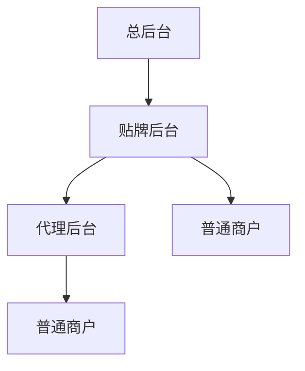
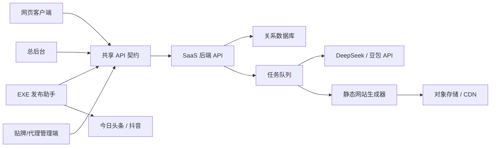

# 豆包获客系统项目计划总纲

> 文档状态：V0.9 产品、架构与实施基线  
> 编制日期：2026-08-06  
> 当前阶段：商户网页客户端独立验收收口；EXE 与媒体发布自动化冻结，待网页客户端验收通过后恢复

## 0. 文档体系与优先级

本文件是项目最高级别总纲，负责记录已经确认的产品方向、范围、架构边界和实施顺序。详细规则拆分到以下文档：

- [产品需求规格](docs/PRODUCT_REQUIREMENTS.md)：页面、功能、角色、状态和统计口径。
- [系统架构说明](docs/SYSTEM_ARCHITECTURE.md)：技术栈、应用边界、数据流、安全和本地开发结构。
- [交付与质量门](docs/DELIVERY_AND_QUALITY_GATES.md)：阶段顺序、测试、验收和发布标准。
- [建议与未决事项](docs/RECOMMENDATIONS_AND_OPEN_DECISIONS.md)：尚未由用户确认的重要选择及推荐默认值。

文档冲突时按以下顺序处理：

1. 用户最新明确决定。
2. 本项目总纲中的已确认决策。
3. 对应专项文档。
4. Mock、原型和代码中的临时实现。

发现冲突后必须先更新文档再继续开发，禁止用代码反向决定产品规则。

### 0.1 当前质量门快照（2026-08-10）

- G0：文档与契约已建立；历史进度段落作为时间线保留，不代表当前状态。
- G1：商户网页客户端本地功能、测试和生产构建通过。
- G2：发布助手多工作区、媒体账号隔离、自动提交代码链路、会话加密迁移、安装包和本地模拟验收通过。
- G2.5：仅部分通过。尚未使用专用真实头条/抖音账号完成两平台最终提交、公开链接核验、同平台多账号、跨设备恢复和风控回退验收。
- G3～G6：真实后台 API、总后台、贴牌端和代理端的本地核心功能与权限验收通过。
- G7：AI、文章、发布任务、豆包检测、网站生成等本地业务链路已经接通；真实媒体平台和公网 OSS/CDN 仍是外部闭环缺口。
- G8：未完成，不能将当前版本作为正式生产交付。

## 1. 项目定位

建设一套只围绕“豆包可见度优化”的网站 SaaS，通过统一的企业资料、问题词、内容生产、企业官网、头条/抖音图文分发以及豆包 API 检测，形成简单、可执行、可追踪的获客闭环。

系统不是通用 GEO 平台，不追求平台数量和功能数量。V1 只做好以下闭环：

```text
企业资料
→ DeepSeek 拓展问题词
→ DeepSeek 生成一致性内容
→ 企业官网沉淀内容
→ 本地客户端发布头条和抖音图文
→ 后台调用豆包 API 搜索问题词
→ 统计公司名称或简称命中情况
→ 根据结果继续优化内容
```

## 2. 产品原则

1. 简洁实用：只保留直接服务获客闭环的功能。
2. 数据真实：不使用随机在线状态、虚假曝光或无法说明口径的数据。
3. 内容一致：官网、头条、抖音均引用同一份企业事实资料。
4. 一个商户一个站：不建设城市分站和关键词站群。
5. 资源节约：企业站优先静态生成，图片使用对象存储和 CDN。
6. 权限隔离：总后台、贴牌、代理、普通商户严格按租户和上下级隔离。
7. 密钥自备且保密：每个贴牌自行提供所选大模型平台的 API 密钥，贴牌之间完全隔离，代理和普通商户不能查看。
8. 人工可控：AI 内容生成成功后直接进入可发布文章列表，商户可自行编辑、停用或删除；验证码和平台风控必须人工处理。
9. 口径明确：界面显示“豆包收录数”，其定义仅为豆包 API 回答中命中公司全称或简称的问题数，不宣传为豆包 App 官方索引收录或曝光数据。
10. 品牌集中管理：总后台为每个贴牌维护一份 SaaS 品牌配置，贴牌、代理和普通商户只能继承，不能自行修改或形成多级贴牌。

## 3. V1 核心目标

V1 完成以下六项能力：

- 建立总后台、贴牌、代理、普通商户四级 SaaS 体系。
- 商户填写一次企业资料，自动生成一个简洁企业官网。
- DeepSeek 根据关键词、公司名称和企业资料拓展问题词并生成文章。
- 本地浏览器执行客户端完成今日头条、抖音图文发布。
- 后台通过豆包 API 搜索问题词并统计企业名称或简称命中量。
- 商户控制台展示四个核心数据：问题总量、豆包收录数、电话曝光量、电话点击量。

## 4. 系统角色与权限



### 4.1 总后台

总后台只负责平台级管理：

- 创建、停用和管理贴牌。
- 查看和管理全部贴牌、代理、商户。
- 设置系统默认配置和系统资源上限。
- 管理总后台、商户网页客户端、贴牌/代理管理端和企业内容站四类域名绑定。
- 设置、修改和审计各贴牌的系统昵称、Logo 与域名配置。
- 查看任务状态、异常、用量和审计日志。
- 处理贴牌无法解决的系统问题。

总后台原则上不直接代替贴牌经营商户，避免权限和业务混乱。

### 4.2 开通贴牌

总后台使用以下表单开通贴牌：

| 字段 | V1 规则 |
|---|---|
| 账号 | 必填，6～12 位英文字母或数字，忽略大小写后在贴牌/代理管理端登录域内全局唯一 |
| 密码 | 必填，6～12 位，只允许英文字母或数字，不要求两类字符同时出现 |
| 公司名 | 必填，作为贴牌主体名称 |
| 可开代理数 | 必填，非负整数，限制该贴牌可保有的代理账号数 |
| 可开用户数 | 必填，非负整数，限制该贴牌直属及全部代理下普通商户的总席位数 |
| 算力点数 | 必填，非负整数，作为该贴牌可自用或向下分配的内部调用配额 |
| 写作篇数 | 必填，非负整数，作为该贴牌及全部下级共享的 AI 成功生成文章篇数池 |
| 主域名 | 选填，只填写域名，不带协议、端口和路径；留空时使用平台已启用的企业内容站根域名 |
| 到期时间 | 必填，由总后台设置 |

- 创建贴牌时同时创建租户、主管理账号、额度账本和域名继承记录，任一步失败全部回滚。
- 主域名只影响该贴牌及下级企业内容站分发，不作为总后台入口；外部域名完成唯一性、DNS 所有权和 HTTPS 证书验证后才能启用。
- 系统昵称和 Logo 仍由总后台在独立品牌设置中维护，不混入开户表单，也不授权贴牌自行修改。
- 密码保存和登录防护规则与普通商户一致，任何后台均不能回显原密码。

### 4.3 贴牌后台

- 查看并使用总后台为本贴牌设置的系统昵称、Logo 和后台品牌信息，不能自行修改。
- 提交或查看本贴牌的自有域名资料；实际绑定、解绑和切换由总后台完成。
- 设置所属商户网站的默认模板，V1 可使用平台提供的三套模板。
- 创建和管理代理。
- 创建和管理普通商户。
- 在贴牌后台添加、更换、停用和测试大模型 API 配置，分别指定 DeepSeek 写作配置和豆包检测配置，并承担对应 API 费用。
- 在贴牌后台配置并测试本贴牌的对象存储，承担所属商户图片、静态站文件和 CDN 流量费用。
- 选择所属单个商户或全部商户发起豆包 API 命中检测，并承担对应接口费用。
- 给代理、商户分配账号期限和使用额度。
- 查看所属代理、商户的任务及汇总数据。

### 4.4 开通代理

只有贴牌可以在贴牌/代理共用管理端内开通直属代理：

| 字段 | V1 规则 |
|---|---|
| 账号 | 必填，6～12 位英文字母或数字，忽略大小写后全局唯一 |
| 密码 | 必填，6～12 位，只允许英文字母或数字，不要求两类字符同时出现 |
| 公司名 | 必填，作为代理主体名称 |
| 可开用户数 | 必填，非负整数，作为该代理可保有的普通商户席位数 |
| 算力点数 | 必填，非负整数，从贴牌可分配点数中扣减 |
| 写作篇数 | 必填，非负整数，作为代理及其下属商户共享的 AI 成功生成文章篇数池 |
| 主域名 | 选填，只填写域名，不带协议、端口和路径；留空时继承上级贴牌已启用的企业内容站根域名 |
| 到期时间 | 必填，不得晚于上级贴牌到期时间 |

- 创建代理时，可开代理数、可开用户数、算力点数和写作篇数的校验、预留与账号创建必须在同一事务中完成，不能超额或因重复提交重复扣减。
- 分给代理的可开用户数从贴牌剩余普通商户席位中预留；贴牌直属商户和全部代理预留之和不能超过贴牌可开用户数。
- 代理主域名只用于其下属商户企业内容站分发，不改变贴牌/代理管理端入口、系统昵称、Logo、API 或对象存储继承关系。
- 填写外部主域名只创建待验证记录，完成唯一性、DNS 所有权和 HTTPS 证书验证后才能启用；留空或验证失败时继续使用上级贴牌根域名。
- 密码保存和登录防护规则与普通商户一致，任何后台均不能回显原密码。

### 4.5 代理后台

- 只能创建和管理普通商户。
- 不能继续创建代理。
- 只能使用所属贴牌提供的 AI 配置。
- 自身及自建商户只能使用所属贴牌提供的大模型 API、对象存储和 CDN 配置，不能添加独立资源接口。
- 代理后台的系统昵称和 Logo 只能复用所属贴牌，不能自行修改。
- 不能查看 DeepSeek、豆包 API 密钥。
- 不能发起单商户或批量豆包检测，只能查看权限范围内的商户检测汇总。
- 不能超出贴牌分配的账号期限和额度。
- 只能查看自己创建的商户及其汇总情况。

### 4.6 开通普通商户

贴牌和代理在共用管理端内使用同一套“开通普通商户”表单：

| 字段 | V1 规则 |
|---|---|
| 用户名 | 必填，6～12 位英文字母或数字，忽略大小写后全局唯一 |
| 密码 | 必填，6～12 位，只允许英文字母或数字，不要求两类字符同时出现 |
| 企业名 | 必填，作为商户账户名称；企业官网的完整事实资料仍由商户进入企业资料页维护 |
| 关键词数量 | 必填，非负整数，作为该商户可创建关键词的上限 |
| 算力点数 | 必填，非负整数，作为 AI 拓展词和 AI 写作的内部调用配额 |
| 写作篇数 | 必填，非负整数，作为该商户可成功生成的 AI 文章篇数额度 |
| 主域名 | 选填，只填写域名，不带协议、端口和路径；留空时从所属贴牌已启用的企业内容站根域名自动分配二级域名 |
| 到期时间 | 必填，不得晚于创建者自身有效期 |

- 贴牌直接创建商户时占用贴牌一个未预留普通商户席位；代理创建商户时占用代理一个已获配席位。关键词数量、算力点数和写作篇数按各自额度校验，均不得透支。
- 写作篇数只在 AI 文章成功生成并进入文章列表后扣减；生成失败、取消和手动添加文章不扣减，同一幂等任务不能重复扣减。
- 发布不设置商业篇数上限，只执行并发、频率、重复任务和平台风控保护。
- 算力点数采用“预占 → 成功确认 / 失败退回”账本，不能只覆盖一个余额数字。
- 主域名字段只表示域名申请或分配意图，不表示录入后立即生效。自定义外部域名必须经过唯一性、DNS 所有权和 HTTPS 证书验证；代理可以提交但不能绕过域名权限直接启用。
- 密码只在创建表单中录入，提交后服务端使用强密码哈希保存，任何后台均不能回显原密码；登录接口必须有失败限流、短时锁定和安全审计。

### 4.7 普通商户

- 维护自己的企业资料和联系方式。
- 管理关键词、问题词和文章。
- 管理自己的企业网站。
- 从三套网站模板中预览并选择一套当前模板。
- 创建头条、抖音发布任务。
- 使用本地客户端执行发布。
- 只读查看自己的豆包 API 命中结果和明细，不能发起或重试检测。
- 查看四项核心数据。
- 网页客户端的系统昵称和 Logo 自动沿归属链继承所属贴牌，不能自行修改。
- 无论由贴牌直接创建还是由代理创建，都只能通过平台后端使用所属贴牌的大模型 API、对象存储和 CDN 配置。

普通商户不能查看其他商户，也不能查看任何上级密钥。

### 4.8 SaaS 品牌配置与继承

- 每个贴牌只有一份有效 SaaS 品牌配置，至少包含系统昵称和 Logo，配置所有权属于总后台。
- 只有总后台可以设置、更换或恢复贴牌的系统昵称和 Logo；贴牌、代理和普通商户均无修改权限。
- 代理不拥有独立品牌配置，只能复用直属上级贴牌的配置。
- 普通商户无论由贴牌直接创建还是由代理创建，都沿归属链继承最终所属贴牌的配置。
- 网页客户端以及贴牌/代理共用管理端左上角统一显示解析后的系统昵称与 Logo；配置缺失时使用平台默认品牌。
- 企业公开网站使用商户企业资料中的公司名称和企业 Logo，不直接套用 SaaS 左上角品牌，避免混淆平台品牌与客户品牌。
- 总后台的品牌变更必须记录审计日志，并通过配置版本让相关客户端及时刷新，不能由每个页面保存一份副本。

## 5. 多租户与账号规则

- 所有业务数据必须带有贴牌租户标识和商户归属标识。
- 代理、商户查询数据时必须同时执行权限过滤，不能只靠前端隐藏菜单。
- 账号停用或到期后停止新增生成、检测和发布任务，已有官网可由上级决定继续展示或暂停。
- 下级账号有效期不能超过上级账号有效期。
- 下级可用额度不能超过上级可分配余额。
- “可开用户数”指普通商户席位：贴牌额度覆盖直属商户和全部代理下商户；分配给代理时先预留，不能在贴牌与代理两边重复使用。
- 未关闭的代理或商户均占用席位；仅到期、停用不自动返还，完成明确关闭流程后才返还，避免通过反复停用绕过上限。
- 关键操作记录审计日志，包括开通账号、修改配置、域名绑定和额度变动。

## 6. AI 配置与继承

### 6.1 配置层级

- 平台不提供默认大模型密钥，不承担模型推理费用，也不提供自建模型算力。
- 每个贴牌必须在贴牌后台添加自己的 API 配置。可以使用一套火山方舟 Key 调用其已开通的 DeepSeek 与豆包模型，也可以为两个用途分别使用其他受支持接口。
- 代理和普通商户自动继承所属贴牌的有效配置。
- 一个贴牌可以保存多条 API 配置，但“问题拓展/文章写作”和“豆包检测”两个用途各只能选择一条当前生效配置，V1 不做自动故障转移。
- 贴牌授权管理员可以新增、更换、测试、停用、删除和分配本贴牌配置用途；保存后只能看到掩码、模型名、状态和最近测试结果，不能重新读取完整密钥。
- 代理和普通商户只看到“可用/不可用”，不显示密钥、接口地址或上级配置详情。
- 配置缺失、失效、欠费、限流或余额不足时，任务失败并提示贴牌处理；系统永不回退到平台或其他贴牌密钥。

### 6.2 大模型 API 配置字段与调用方式

贴牌后台提供“大模型 API”列表和新增/编辑弹窗，参考成熟系统的交互方式，但只保留必要字段：

- 自定义别名。
- 用途：问题拓展/文章写作、豆包检测，或两者兼用。
- 大模型平台：DeepSeek 官方、火山方舟、自定义 OpenAI 兼容接口。
- 请求接口地址；选择预设平台时自动填充且不可随意修改，自定义平台时允许填写。
- API Key。
- 模型名称或模型 ID。
- API 协议：Chat Completions 或 Responses API。
- 是否启用联网搜索；豆包检测用途必须启用并通过能力测试。
- 启用状态、最近测试时间、测试结果和脱敏错误摘要。

V1 不照搬参考系统中与本项目无关的智谱、通义、百度、混元、Kimi 等平台选项。提供方采用适配器结构，后续增加平台时不修改文章和检测业务。自定义地址必须为 HTTPS，并执行域名解析、私网/回环/云元数据地址拦截、重定向复检和超时限制，不能把后台变成任意请求代理。

DeepSeek 写作配置必须通过结构化文本生成测试；豆包检测配置必须通过 Responses API、实际 `web_search_call`、最终回答文本和至少一条可核验 HTTPS 信源测试。测试成功只代表接口可调用，不代表任意头条或抖音内容一定能被召回。

根目录本地密钥文本只允许用于开发验证，不是正式配置来源，不进入 Git、安装包、日志、截图、Mock 或部署产物。正式系统中的贴牌密钥通过后台录入后加密保存。

### 6.3 DeepSeek 职责

DeepSeek 只负责：

- 根据公司名、简称、关键词、业务范围拓展问题词。
- 对问题词进行基础去重。
- 根据企业事实资料生成官网文章。
- 从同一内容源生成头条版和抖音图文版文案。
- 按指定格式返回结构化结果。

DeepSeek 不负责豆包命中检测。

### 6.4 豆包 API 职责

豆包 API 只负责：

- 接收系统提交的问题词。
- 返回问题回答文本。
- 返回实际联网回答所附的可核验信源；没有信源的响应不能计入检测成功。
- 由系统检查回答中是否包含商户设置的公司全称或简称。
- 保存检测结果用于命中统计和历史查看。

豆包候选方案为`doubao-seed-2-0-lite-260215`配合 Responses API Web Search；正式开发前仍需用贴牌测试密钥验证真实回答、返回信源、调用配额、费用和商业使用条件。

### 6.5 算力点数与写作篇数扣减

V1 已确认的固定扣减规则：

- AI 拓展词：每成功新增并保存 1 个去重后的拓展结果词，扣 1 点。
- AI 写作：每成功生成并进入文章列表 1 篇，扣 30 点，同时扣 1 篇写作额度。
- 重复词、未保存结果、生成失败、取消任务、手动添加关键词、手动添加问题词和手动添加文章均不扣点。
- 批量任务提交前按最大计划消耗预占；完成后按实际成功结果确认扣减，并退回失败、重复或未入库部分。
- 所有预占、确认、退回操作使用同一业务幂等键和不可变流水，任务重试不能重复扣减。
- 豆包检测不扣算力点数，也不设置次数、日额度或商户级商业限制；每次检测固定调用最终所属贴牌配置的豆包 API，第三方费用由贴牌承担。
- 系统仍按队列安全并发执行，并对提供方返回的限流进行退避重试；运行中的相同任务执行幂等拦截。这些是稳定性保护，不减少贴牌最终可发起的总查询次数。

## 7. 商户核心业务模块

### 7.1 企业资料

作为全系统唯一企业事实来源，至少包括：

- 公司或门店全称。
- 品牌简称，可设置多个。
- 所属行业和核心业务。
- 服务或产品介绍。
- 企业简介和优势。
- 服务范围。
- 地址、电话、微信和二维码。
- 营业时间。
- 资质、案例和可公开证明材料。
- Logo、门店图、产品图等图片素材。

网站、文章和平台文案不得分别维护企业名称、联系方式等核心事实。

### 7.2 关键词与问题词

- 商户录入核心关键词。
- DeepSeek 结合企业资料拓展自然问句。
- 对完全相同或高度相似的问题进行基础去重。
- 支持启用、停用、删除和重新生成。
- 问题保留来源关键词和生成时间。
- 问题可进入写作、豆包检测两个后续流程。

### 7.3 内容创作

内容创作拆成“创作准备、创建任务、任务进度、文章列表”四个简单页面。参考系统中的文章分类、模板风格、独立标题指令等选项在 V1 不开放，由系统自动处理。

#### 7.3.1 创作准备

创作前只维护四类可复用资料：

1. 优化关键词：关键词及其已经拓展的问题词。
2. 企业信息库：产品服务、产品特点、品牌故事、用户痛点、信任背书、客户案例和其他真实信息。
3. 企业图库：按业务或产品建立图库并上传真实图片。
4. 创作指令：保存常用的文章风格和写作要求。

一个商户可以建立多个企业信息库和图库，方便区分不同产品或业务。公司全称、简称和联系方式仍然统一读取商户企业资料，不允许在多个信息库中分别维护，避免内容冲突。

创作指令只保留两个字段：

- 指令名称。
- 指令内容。

系统提供一个默认创作指令，商户可以新增自己的指令。默认指令引导模型生成1000～1200字HTML正文、3～4个二级标题、单段尽量不超过150字、企业名自然出现2～3次，并加入2～3个模糊化数据支撑点，结尾不设置FAQ。`{训练词占位符}` 自动替换为优化关键词，`{转化词占位符}` 自动替换为企业全称。标题提示引导模型完整包含关键词、准确对应问题意图、建议20～30字且不超过30字；企业名只在自然时加入，年份仅用于榜单、趋势、价格或年度变化等时效性主题。上述内容均是生成指令，不再作为入库硬拦截或触发二次模型纠偏；模型成功返回非空、容量合规的标题和正文即可入库。

#### 7.3.2 新建 DeepSeek 创作任务

新建任务表单只保留以下六项：

| 选项 | 规则 |
|---|---|
| 优化关键词 | 必选；下拉展示关键词名称、问题总量和未创作数量 |
| 企业信息库 | 可选；不选走基础写作模式，选择一个后走事实增强模式 |
| 企业图库 | 可选；不选时生成无图文章 |
| 文章配图数量 | 必选；0、1、2 或 3 张，默认 0 张；无图库时只能为 0 |
| 创作指令 | 必选；默认使用系统创作指令，也可选择商户自定义指令 |
| 创作篇数 | 必填；1～100 篇，默认 1 篇 |

系统自动处理以下字段，不要求商户填写：

- 任务名称：按关键词和创建时间自动生成。
- 文章分类：默认归入所选优化关键词。
- 文章标题：使用问题词。
- 文章状态：模型成功返回可入库文章后统一进入“可发布”，不设置人工审核步骤。

创建任务时需要检查：

- 创作篇数不能超过 100。
- 创作篇数不能超过该关键词当前可用的问题数量。
- 已选择图库时，有效图片数不能少于单篇配图数量；未选择图库时配图数必须为 0。
- 已选择的企业信息库、图库、创作指令必须属于当前商户。
- 已经成功生成文章的问题默认跳过，防止重复创作。
- 可用写作篇数不少于计划创作篇数，且可用算力点数不少于“计划创作篇数 × 30”；提交成功后先预占，任务结束按实际成功篇数结算。

#### 7.3.3 生成逻辑

- 每个问题词对应生成一篇基础文章。
- 基础写作模式只要求公司名/简称、问题词、关键词、文章方向和创作指令；可补充场景化行业常识和营销表达，但不能补造地址、价格、资质、排名、评价、案例、实测或效果数据。
- 事实增强模式同时接收企业统一资料、所选企业信息库和创作指令，可引用信息库内的明确事实；创作指令不能覆盖企业真实事实。
- 有图库时从所选图库中选取指定数量图片，同一篇内不重复；无图库时文章以 0 张配图入库。
- 一次创建最多 100 篇是任务上限，不代表同时发起 100 个接口请求。
- 后台通过任务队列分批生成，记录成功、失败和当前进度。
- 单篇失败只重试该篇，不重新生成整个任务。
- 生成结果长期保留，不采用“发布后自动删除文章”的规则。
- 一篇文章就是唯一规范版本：企业网站、头条和抖音均复用该文章的不可变快照；发布助手仅做平台所需的格式适配，不调用 AI 再生成渠道改写版本。
- 保存内容和企业信息库版本，避免资料修改后历史内容无法追溯。

建议文章采用简单固定结构：

```text
问题标题
→ 直接回答
→ 适用情况和选择建议
→ 企业服务说明及真实依据
→ 注意事项或服务边界
→ 联系方式
```

#### 7.3.4 创作任务与文章列表

创作任务列表展示：

- 任务名称。
- 优化关键词。
- 计划篇数。
- 已完成篇数。
- 失败篇数。
- 企业信息库。
- 企业图库及单篇配图数。
- 创作指令。
- 状态和进度。
- 创建时间和完成时间。

任务状态只保留：排队中、创作中、部分失败、已完成、已停止。

所有 DeepSeek 成功生成的文章自动进入统一的文章列表，不再为 AI 文章建立另一套列表。商户已经写好的文章也可以直接点击“添加文章”，粘贴并保存到同一个列表中。

文章来源只分为：

- AI 生成。
- 手动添加。

手动新增文章只保留以下字段：

| 字段 | 规则 |
|---|---|
| 文章标题 | 必填 |
| 文章正文 | 必填；使用简单富文本编辑器 |
| 封面及正文图片 | 可从企业图库选择，也可直接上传 |
| 关联优化关键词 | 可选；用于归类和后续查看 |
| 内容状态 | 默认为草稿，可选择可发布或停用；待审核仅作为历史兼容状态保留 |

简单编辑器只需支持标题层级、加粗、列表、引用、链接、图片和段落，不加入复杂排版组件。保存时需要过滤不安全 HTML，避免脚本注入和异常样式破坏网站。

文章列表展示：

- 标题。
- 来源。
- 关联优化关键词。
- 内容状态。
- 更新时间。
- 编辑、预览、发布/下线、删除操作。

AI 生成文章成功入库后直接进入“可发布”，手动添加文章默认进入“草稿”。两种来源的文章都可以进行简单编辑，也都可以发布到企业网站并生成头条、抖音图文版本。

文章编辑只修改当前文章，不反向修改企业信息库、问题词和其他文章。已经发布到网站的文章修改后，需要生成新版本并重新生成对应静态页面。

文章列表支持查看、编辑、重新生成、发布、停用和删除，不设置人工审核操作。删除文章属于用户主动操作；已经发布的文章删除前需要明确提示影响，系统不能因文章发布成功而自动删除。

### 7.4 企业网站

每个普通商户只生成一个网站，V1 提供三套可选模板。三套模板共用同一套页面数据、路由、结构化数据和静态生成程序，只调整布局、配色和内容展示重点，不分别开发三套业务逻辑。

#### 7.4.1 三套首发模板

| 模板 | 适用对象 | 首页展示重点 |
|---|---|---|
| 简约企业型 | 企业服务、生产制造、专业机构 | 企业定位、核心服务、企业优势、重点问题、文章和联系方式 |
| 本地门店型 | 本地生活、门店、到店服务 | 门店信息、服务项目、营业时间、地址地图、电话微信和常见问题 |
| 品牌内容型 | 重视品牌介绍、案例和内容沉淀的商户 | 品牌介绍、真实背书、案例、专题问题、最新文章和联系方式 |

模板选择规则：

- 贴牌可以设置默认模板，普通商户可以在三套模板中自行选择。
- 模板管理页提供桌面端和移动端预览。
- 一个网站同一时间只能启用一套模板。
- 切换模板不复制文章、不改变域名和页面地址，只触发静态网站重新生成。
- 三套模板都必须完整展示企业名称和联系方式。
- V1 不允许商户上传自定义模板，也不提供拖拽装修。

#### 7.4.2 统一页面结构

建议网站页面：

- 首页：企业定位、核心服务、重点问题、最新文章、联系方式。
- 服务页：产品或服务列表和详情。
- 问题页：用户问题及直接答案。
- 文章页：完整软文内容。
- 关于/联系页：企业简介、资质、地址、电话、微信。

三套模板可以调整首页区块顺序和视觉样式，但不能改变以上核心信息结构，避免不同模板造成内容缺失或抓取结果不一致。

#### 7.4.3 统一抓取和性能要求

网站必须具备：

- 服务端输出完整 HTML，正文不依赖 JavaScript 加载。
- 清晰的标题层级和语义化结构。
- Organization 或 LocalBusiness、Article、FAQPage 结构化数据。
- 自动生成 sitemap.xml、robots.txt 和 canonical。
- 首页、服务、问题和文章之间建立内部链接。
- 移动端适配。
- 页面固定展示真实联系方式。
- 不生成空产品页、空案例页和无实际内容的栏目。

### 7.5 媒体发布

V1 只支持：

- 今日头条图文。
- 抖音图文。

#### 7.5.1 扫码登录与账号保持

网页客户端提供“媒体账号”页面，但不直接接收、展示或解密平台 Cookie。客户可以从网页客户端发起连接，也可以直接在 EXE 发布助手中添加账号，实际扫码登录必须在客户电脑上的 EXE 发布助手和本地浏览器中完成。发布助手验证登录后，把经过平台域名白名单过滤的可移植会话包交给平台后端使用托管密钥加密备份，用于同一商户在新电脑恢复。会话包必须包含完整 Cookie 属性、相关 Origin 的 LocalStorage、SessionStorage 和 IndexedDB；各项按来源与版本记录，不能只保存 `document.cookie` 字符串。

```text
客户点击连接头条或抖音
→ 唤起 EXE 发布助手
→ 发布助手打开该平台的独立本地浏览器资料目录
→ 客户在本机扫描平台二维码
→ 发布助手验证登录成功
→ 浏览器 Cookie、LocalStorage 和账号环境保留在本机
→ 发布助手提取经白名单过滤的 Cookie、LocalStorage、SessionStorage、IndexedDB 可移植会话包并通过 HTTPS 上传
→ 平台后端使用 KMS/信封加密保存会话备份和不可逆元数据
→ 后台页面只显示绑定、备份和验证状态，永不返回明文凭证
```

登录保持规则：

- V1 每个商户允许绑定多个今日头条账号和多个抖音账号；每个账号使用独立、不可猜测引用的浏览器资料目录。
- 头条和抖音使用相互独立的浏览器资料目录，不能共用 Cookie 文件。
- 同一账号后续发布任务复用本地持久化资料目录，正常情况下无需每次扫码。
- Cookie 有效期由平台控制，不能承诺永久免登录。
- 平台主动退出、账号改密、设备校验或风控导致失效时，发布助手必须暂停任务并提示重新扫码。
- 更换电脑或清除本地资料后，商户登录 EXE 即可请求恢复所属媒体账号的加密会话备份；恢复后必须访问对应发布页重新验证，验证失败时仍需扫码。
- 平台可能把会话与设备指纹、IP、IndexedDB 或其他本地状态绑定，因此跨机恢复只能作为减少重复登录的能力，不能承诺 100% 成功或永久有效。

后台允许保存以下数据：

- 商户、平台和本地设备绑定关系。
- 平台账号昵称或脱敏标识。
- 本地账号资料的不可逆引用 ID，不能包含本地路径和 Cookie。
- 已连接、已过期、需验证、已解绑等状态。
- 最近验证时间、最后心跳时间和失败原因。
- 经平台托管密钥信封加密的最小媒体会话备份，以及密钥提供方、密钥版本、内容版本、校验和、来源设备、备份/恢复/撤销时间等不可逆元数据。

严禁以明文、可检索 JSON、日志、缓存、审计详情或前端响应保存/返回平台 Cookie、LocalStorage 和登录 Token；严禁上传二维码登录临时凭证、平台账号密码、完整浏览器资料、缓存和浏览历史。会话明文只允许在已认证 EXE 与专用加解密服务的短生命周期内存中短暂存在，传输必须使用 HTTPS，落库前必须由随机数据密钥加密，数据密钥再由平台托管 KMS 包装。EXE 发布助手的本地敏感元数据继续使用 Windows 用户级加密和目录权限保护。

#### 7.5.2 发布任务

云端后台负责生成任务和内容，本地客户端负责浏览器执行：

```text
后台创建发布任务
→ 本地客户端拉取任务
→ 打开对应平台的本地浏览器账号环境
→ 填写标题、正文和图片
→ 自动提交发布
→ 核验公开结果并回传链接、步骤和状态
→ 回传成功、失败、链接和错误原因
```

客户端要求：

- 平台登录状态和完整浏览器资料保存在商户本机；云端只保存经 KMS 信封加密的可移植会话包，字段范围固定为完整 Cookie 属性、相关 Origin 的 LocalStorage、SessionStorage 和 IndexedDB。
- 云端不保存平台账号密码、二维码临时态、完整浏览器资料或任何可由后台页面/API直接读取的明文 Cookie、Token。
- 验证码、短信验证和平台风控交由用户处理，不尝试绕过。
- 发布动作有频率限制、失败重试上限和人工暂停开关。
- 平台页面变化后能明确报告失败步骤，不能把失败记成成功。

网页端批量编排规则：

- 用户在文章列表审核文章后，进入发布任务页多选文章和目标平台；默认同时选择今日头条、抖音。
- 发布任务页提供“单平台去重 / 全平台去重”。单平台去重时，同一文章可在头条发一次、抖音发一次；全平台去重时，文章只要在任一目标平台已有任务，其他平台也不再创建。失败只重试原任务。
- 批次选择发布平台、目标媒体账号、发布数量和文章库。选中多个账号时，文章在同平台账号间轮询分配，不把同一篇文章广播给同平台全部账号。
- 每个平台默认每日发布 3 篇，用户可分别调高；该值是调度速率，不是商业发布额度。未到执行时间的任务保留计划时间，EXE 只能领取已经到期的任务。
- 一次批次会固化所选文章版本、图片快照、平台、每日数量、时区和幂等键；后续编辑文章不静默改变已创建任务。
- 未指定具体发布时间段前，系统只实现每日配额和可审计计划时间，不自行假设固定运营时刻。

单机多商户执行规则：

- 一个 Windows 电脑允许同时为多个普通商户执行任务，但只运行一个发布助手主进程；禁止用多个 EXE 进程争抢任务和同时写同一浏览器资料目录。
- EXE 支持多个商户工作区。每个商户使用与网页客户端相同的账号密码完成一次登录，随后把可撤销设备令牌保存在 Windows 用户级安全存储；网页深链只传短期配对信息，不传密码或长期令牌。
- EXE 无已保存商户会话时，启动后先显示独立登录页，不展示业务导航；仅有一个有效会话时直接进入该商户工作区；保存多个商户会话时显示工作区选择与“添加账号”。账号密码输入框不得常驻媒体账号、任务或日志页面，当前顶部登录表单仅作为开发联调临时界面。
- 浏览器资料按“商户 ID × 平台 × 平台账号”隔离；一个商户可以绑定多个头条和多个抖音账号，每个资料目录同一时间只有一个执行者。一个商户仍只允许一台活动发布设备，但同一物理设备可以绑定多个商户。
- 同一商户内部按目标媒体账号逐条串行发布，不并行操作该商户的多个账号；不同商户的任务允许并行。调度器可在不同商户间轮询，并发仍受本机资源、平台风控和任务租约限制。
- 全自动是目标模式：当登录、素材、页面结构和发布前校验均通过时，适配器自动点击最终发布。出现验证码、短信、设备确认、未知弹窗、页面改版或结果不可核验时立即暂停并转人工，不绕过验证、不把未知状态重试成重复发布。

### 7.6 豆包 API 检测

检测任务只能由贴牌角色在贴牌/代理管理端创建，代理和普通商户无创建或重试权限。贴牌可以选择一个所属商户查询，也可以对本贴牌全部有效商户批量查询。

检测流程：

```text
贴牌选择单个商户或全部商户
→ 统计目标商户数、有效问题词数和预计 API 调用次数
→ 批量全部查询二次确认
→ 固化问题快照并拆分异步任务
→ 后台调用豆包 API
→ 获取回答文本
→ 规范化回答、公司全称和简称
→ 判断是否包含任一名称
→ 保存命中或未命中
→ 更新商户统计
```

简单命中规则：

- 回答中包含公司全称或任一简称，即该问题命中一次。
- 不要求引用官网、头条或抖音链接。
- 一个回答同时命中多个名称，仍只计算一次。
- 匹配时忽略大小写、空格和常见标点。
- 同一问题以最新一次成功检测结果作为当前统计值。
- 检测失败不覆盖上一次成功结果，并单独记录失败原因。

每条检测至少保存：问题、回答文本、是否命中、命中的名称、检测时间、接口状态。

- 相同贴牌、商户、问题和检测版本已有运行中任务时禁止重复创建。
- 批量任务按商户和问题分片执行，支持仅重试失败项。系统只做队列安全并发、提供方限流退避和运行中重复任务拦截，不设置贴牌、商户、日/月次数等商业上限。
- 普通商户网页端只读展示自己的命中数据、问题明细、回答和检测时间；不能看到其他商户，也不能调用创建或重试接口。

## 8. 商户控制台

### 8.1 账户与额度概览

网页客户端控制台顶部展示当前商户的真实账户与资源信息：

```text
账户信息 | 到期时间 | 关键词数量 | 算力点数 | 写作篇数 | 文章数量 | 发布篇数 | 图片存储空间
```

- 账户信息显示当前商户名称、登录账号和账号状态。
- 关键词数量显示“当前未删除数量 / 开户分配上限”。
- 写作篇数显示“已成功生成 / 开户分配上限”或等价的剩余额度。
- 文章数量显示当前未删除文章总数，包括 AI 生成和手动添加文章，不虚构未设置的文章上限。
- 发布篇数显示累计成功的媒体发布记录数，不作为额度；同一篇文章分别成功发布到头条和抖音时计为 2 条。
- 算力点数显示可用余额及本期已消耗点数。V1 对 AI 拓展词按 1 点/个、AI 写作按 30 点/成功篇扣减；它不是现金、充值货币或第三方 API 余额，实际模型费用仍由贴牌自备密钥承担。
- 图片存储空间显示当前商户已使用容量；以后配置了容量上限时再显示“已用 / 上限”。数值依据平台保存的对象元数据汇总，并通过所属贴牌 OSS 定期校准；显示最后更新时间。无法取得可靠数据时显示“暂不可用”，不能显示伪造的 0 或随机值。

### 8.2 问题总量

当前商户未删除的问题词数量。停用的问题是否计入总量，V1 默认计入，并在问题列表中显示状态。

### 8.3 豆包收录数

当前商户的问题中，最新一次成功检测回答包含公司全称或简称的问题数量。这里的“收录”是产品展示名称，不表示豆包 App 官方索引状态。

```text
豆包收录率（名称命中口径） = 豆包收录数 ÷ 已成功检测问题数
```

收录率可以作为小字辅助展示，但必须同时说明名称命中口径，不增加复杂评分体系。

### 8.4 电话曝光量

当网站联系电话区域进入访客可视区域时记录一次曝光。同一访客在同一页面的一次访问中只记录一次，不使用页面 PV 冒充电话曝光。

### 8.5 电话点击量

访客实际点击电话拨号链接或明确的电话联系按钮时记录一次。需要进行基础重复事件过滤和异常频率限制。

### 8.6 效果数据展示

账户概览下方的效果数据区只展示四张数据卡片：

```text
问题总量 | 豆包收录数 | 电话曝光量 | 电话点击量
```

V1 最多增加两张简单趋势图：

- 最近 30 天豆包收录数变化。
- 最近 30 天电话曝光量和电话点击量。

不展示城市数量、AI 来源数量、虚拟在线状态和无法说明来源的指标。

## 9. 域名与网站分发

域名必须按入口和用途分为四类，不能只保存一个无类型的“贴牌域名”。其中企业内容站类在技术上再区分“可分发的根域名”和“商户最终站点主机名”：

### 9.1 总后台访问域名

- 总后台使用平台专属域名和独立登录入口，只允许总后台角色登录。
- 总后台不套用贴牌品牌，不与贴牌/代理管理端或普通商户共享登录 Cookie。

### 9.2 贴牌/代理管理端域名

- 贴牌和其所属代理共用同一个管理端应用、域名入口和登录页。
- 登录后由服务端返回角色与权限，前端据此展示贴牌或代理菜单；隐藏菜单不能代替接口鉴权。
- 平台提供默认管理端域名，贴牌也可在总后台绑定自己的管理端域名。

### 9.3 普通商户网页客户端域名

- 普通商户网页客户端使用独立应用、独立域名入口和独立登录会话。
- 平台提供默认商户端域名，贴牌也可在总后台绑定自己的商户端域名。
- 根据访问 Host 与登录账号共同校验贴牌归属及品牌，不能接受前端任意传入租户标识。

### 9.4 企业内容站根域名

- 总后台维护平台公共内容站根域名，商户按规则自动分配唯一二级域名。
- 贴牌也可提供自有内容站根域名，通过 DNS 验证后为其商户分发二级域名。
- 代理开户时可提交自己的内容站根域名，留空则继承贴牌；商户开户时可提交独立站点主域名，留空则按“代理有效根域名 → 贴牌有效根域名 → 平台根域名”分配二级域名。
- 示例仅用于说明：`merchant.platform-domain.com` 或 `merchant.brand-domain.com`。
- 管理端域名、商户网页客户端域名和企业内容站根域名可以属于同一品牌，但必须作为独立绑定记录管理。

### 9.5 域名变更安全

- 贴牌、代理或商户外部域名的新增、换绑、解绑和切换均由总后台执行并记录审计日志；下级填写只产生待验证申请。
- 同一域名不能同时绑定多个贴牌或用途冲突的站点。
- 启用前必须完成所有权验证、路由检查和 HTTPS 状态检查。
- 切换失败时保留上一条可用绑定，不能让客户入口或全部企业站同时失效。

域名、ICP备案、HTTPS、CDN 和故障切换的具体服务方案在部署设计阶段单独确认。

### 9.6 贴牌自备对象存储

- 本地开发统一使用 MinIO；正式环境优先由每个贴牌配置自己的对象存储，V1 首个预设为阿里云 OSS。
- 存储对象包括企业 Logo/二维码、企业图库、文章配图、网站静态 HTML/CSS/JS、sitemap 和其他公开站点资源。
- 业务数据库、任务状态、审计日志、AI 原始回答、媒体 Cookie 和 EXE 安装包不放入贴牌对象存储。
- 配置字段至少包含存储平台、AccessKey ID、AccessKey Secret、Region/Endpoint、Bucket、对象路径前缀和公开/CDN 域名。
- 上传优先使用短时预签名 URL 或 STS 临时凭证，让浏览器直传贴牌存储，避免图片流量经过平台服务器。
- 每个贴牌使用独立配置和路径前缀；切换存储配置不会自动迁移历史文件，必须先完成显式迁移和校验。
- 贴牌直属商户、贴牌所属代理及代理创建的商户，统一解析并使用最终所属贴牌的存储配置；代理和商户不能建立自己的存储配置。
- 存储配置失效时停止新上传和新网站发布，保留上一个已发布网站，不静默写入平台公共存储。
- V1 不把参考系统的明文密钥表单照搬过来。完整 Secret 保存后不可回显，测试连接使用固定临时对象并在完成后清理。

## 10. 总体架构

V1 采用“独立应用 + 共享契约 + 模块化单体后端”的架构，不提前拆分微服务。普通商户网页客户端、EXE 发布助手、总后台、贴牌/代理管理端是四个独立应用。其中贴牌和代理共用一个管理端应用及域名入口，通过服务端登录鉴权返回角色和权限后展示不同菜单；总后台和网页客户端均使用各自独立入口。



核心组成：

- 网页客户端：面向普通商户的独立业务操作端，包含账户与额度概览、企业资料、关键词、问题、内容、网站、豆包检测、发布任务和统计页面。
- EXE 发布助手：只负责本地账号环境、头条/抖音浏览器执行、人工验证和结果回传。
- 总后台：平台独立管理应用，只允许总后台角色登录，负责贴牌开通、全局资源、品牌、域名、租户和系统运维。
- 贴牌/代理管理端：贴牌和代理共用的独立管理应用；贴牌管理代理、商户和本贴牌资源，代理只管理自己创建的普通商户。
- SaaS 后端：账号、权限、企业资料、内容、任务、统计和域名管理。
- 共享 API 契约：统一网页客户端、EXE 助手、总后台、贴牌/代理管理端和后端的数据结构、错误码与任务状态。
- 任务执行器：AI 生成、豆包检测、静态站生成等异步任务。
- 关系数据库：保存核心业务数据。
- 任务队列/缓存：只用于异步任务、短期状态和限流。
- 对象存储/CDN：保存图片、静态网页和必要附件。

四个应用之间的隔离规则：

- 网页客户端、总后台、贴牌/代理管理端使用不同入口、不同构建产物、不同认证受众和不同 Cookie 名称。
- 贴牌和代理只在贴牌/代理管理端内共用入口与登录会话；菜单由服务端返回的角色和权限生成，任何权限都必须由后端再次校验，不能只靠隐藏菜单。
- EXE 发布助手拥有独立版本号、安装包、升级机制和本地数据目录。
- 四个应用只共享类型定义、接口契约、设计变量和少量无业务含义的基础组件，不跨应用共享登录状态、权限页面和业务路由。
- 后期可以共用经过严格权限隔离的后端 API，以减少重复建设。
- 媒体会话明文、完整浏览器账号环境和本地日志不能进入任何网页端；云端数据库只允许保存平台 KMS 信封加密后的可移植会话包密文及必要元数据。

### 10.1 本地优先开发方式

前期不部署服务器，所有开发和验收在本机完成：

- 先冻结共享 API 契约和任务状态，不先实现完整后端。
- 网页客户端和 EXE 发布助手使用同一套本地 Mock 数据与接口适配层。
- Mock 层必须可以替换为真实 API，页面组件不能直接写死假数据。
- EXE 发布助手先使用本地模拟任务验证界面、队列和日志，再对真实平台做受控发布验证。
- 两个客户端确认后，再实现真实后台 API、数据库、总后台和贴牌/代理管理端。
- 本地开发阶段使用测试账号、测试数据和本地文件，不处理生产域名和正式服务器。

### 10.2 已确认技术栈

- 项目组织：pnpm workspace 单仓库，应用独立构建和发布。
- 网页客户端：Vue 3、Vite、TypeScript、Vue Router、Pinia。
- UI 基础组件：Element Plus，项目自定义设计变量和业务组件。
- EXE 发布助手：Electron、Vue 3、TypeScript、Playwright。
- 总后台：Vue 3、Vite、TypeScript，独立构建和发布。
- 贴牌/代理管理端：Vue 3、Vite、TypeScript，贴牌与代理共用构建产物并按服务端权限展示菜单。
- 后端 API：NestJS、Fastify，采用模块化单体结构。
- 数据库：PostgreSQL、Prisma 和版本化迁移。
- 异步任务：Redis、BullMQ。
- 接口契约：OpenAPI，客户端类型自动生成。
- 前期 Mock：接口适配层和 MSW，不在页面组件中写死数据。
- 企业网站生成：Nunjucks 静态 HTML 模板。
- 对象存储：本地使用 MinIO；正式环境支持贴牌自备阿里云 OSS，适配层预留 S3 兼容存储。
- 测试：Vitest、Playwright、API 集成测试和安装包冒烟测试。
- 本地基础设施：Docker Compose；本地验收通过前不部署正式服务器。

选择该方案的主要原因是网页客户端、EXE、总后台、贴牌/代理管理端和后端均以 TypeScript 为主，可以共享接口类型和工程规范，同时保持四个应用独立。V1 不采用 Tauri、PySide6、Next.js 和微服务，避免增加语言、打包及运行时复杂度。

### 10.3 平台与贴牌资源责任

平台负责并承担：

- SaaS 服务器、后端 API、总后台、贴牌/代理管理端和网页客户端运行环境。
- PostgreSQL、Redis、任务队列、静态网站生成器、租户鉴权、审计和系统运维。
- 调用编排、任务状态、失败恢复、限流和必要的业务数据存储。

贴牌负责并承担：

- 大模型 API 账号、密钥、调用额度和第三方模型费用。
- 对象存储 Bucket、存储容量、外网流量和 CDN 费用。
- 自有资源账号的欠费、权限、配额和凭证轮换。

调用链固定为“代理/商户客户端 → 平台 SaaS API → 解析最终所属贴牌 → 使用贴牌资源配置调用第三方服务”。大模型与存储永久密钥只在平台服务端解密使用；代理、商户网页和 EXE 不接收永久密钥。对象文件可通过平台签发的短时 URL 直接上传到贴牌存储，以降低平台带宽占用。

## 11. 核心数据对象

V1 主要数据对象：

- 租户/贴牌。
- 贴牌 SaaS 品牌配置及版本。
- 用户与角色。
- 上下级关系与额度。
- 普通商户。
- 企业事实资料及版本。
- 企业信息库及版本。
- 企业图库和图片素材。
- 创作指令。
- AI 配置及继承关系。
- 贴牌对象存储配置、密钥状态、路径前缀及迁移记录。
- 总后台访问域名、贴牌/代理管理端域名、商户网页客户端域名、企业内容站根域名、商户站点子域名及证书状态。
- 网站模板、商户模板选择和静态生成记录。
- 关键词。
- 问题词。
- DeepSeek 创作任务和单篇生成明细。
- 内容源、官网文章和媒体版本。
- 文章来源及文章版本。
- 媒体账号绑定状态和平台 KMS 信封加密的可移植会话包，不保存账号密码、二维码临时态或完整浏览器资料。
- 发布任务和发布结果。
- 豆包检测任务和检测结果。
- 电话曝光、电话点击事件及每日汇总。
- 审计日志。

## 12. 资源控制方案

- 企业网站在资料或文章变化时重新静态生成，不在每次访问时查询数据库。
- 静态页面和图片通过 CDN 分发。
- 图片由网页端通过短时签名直传贴牌对象存储，静态站生成结果直接写入所属贴牌存储，平台只保存对象键和必要元数据。
- 问题拓展、文章生成、豆包检测采用异步队列。
- 对相同商户、相同问题的短时间重复检测进行拦截。
- 系统按贴牌设置并发、日/月保护额度，用于防误调用和保护平台编排资源，不作为替贴牌支付模型费用的余额。
- 只保存必要的任务结果，不保存无价值截图和重复中间文件。
- 电话统计事件先做轻量上报，再按天汇总。
- 关键词数、文章数和图片存储空间使用可追溯元数据计算；图片空间采用增量记录并定期与贴牌 OSS 校准，不在每次打开控制台时遍历 Bucket。
- 后台列表和报表默认分页，避免一次加载全部数据。
- V1 只提供三套共用渲染核心的网站模板和两种媒体发布渠道。

## 13. 安全与合规要求

- AI 密钥必须加密保存，日志和接口响应中不得输出完整密钥。
- 对象存储 AccessKey Secret 与 AI 密钥采用同等级加密、掩码、审计和轮换规则；禁止使用阿里云主账号 AccessKey，推荐 RAM 子账号或角色的最小 Bucket/前缀权限。
- 本地开发密钥文件必须在建立 Git 仓库前加入忽略规则，且不得随安装包、备份或部署目录分发。
- 每个接口在服务端验证租户、角色和数据归属。
- 登录、配置修改、额度变动和发布任务保留审计记录。
- 公共统计接口需要限流、防重复和基础防刷。
- 商户上传内容需要文件类型、大小和访问权限检查。
- AI 文章必须支持敏感词和广告法基础检查。
- 禁止自动生成虚假资质、虚假案例、绝对化承诺和伪造专家背书。
- 浏览器自动化必须遵守平台规则，不绕过验证码和账号风控。
- 媒体会话备份必须使用每次随机数据密钥、认证加密、租户/商户/平台/账号绑定的附加认证数据、KMS 包装密钥版本、严格租户鉴权、恢复审计和一键撤销；任何后台角色均不能查看或导出明文会话。
- 正式上线前确认豆包、DeepSeek、头条、抖音相关接口与服务的商业使用条件。

## 14. V1 明确不做

- 城市、区县和关键词批量分站。
- 一个商户生成多个网站。
- 可视化拖拽建站、商户自定义模板和第四套以上模板。
- DeepSeek、豆包以外的多模型矩阵。
- 自建或托管 DeepSeek、豆包推理算力，以及平台公共 AI 密钥兜底。
- 为贴牌长期提供无限量公共图片、静态站存储和 CDN 流量兜底。
- 头条、抖音以外的平台群发。
- B2B 平台发布、自媒体矩阵和短视频生成。
- 自动破解验证码或绕过平台风控。
- CRM、商城、支付、发票、合同等非核心模块。
- 积分商城、可充值现金型积分或与第三方模型余额对账的双重余额体系；V1 只保留简单的算力点数配额账本。
- AI 来源访客猜测、随机在线状态和虚假曝光。
- 城市排名、搜索排名承诺及无法验证的效果评分。

## 15. 实施阶段

### 2026-08-10 开发顺序调整（覆盖旧阶段并行安排）

- 当前唯一开发主线为普通商户网页客户端及其所需真实 API；先完成并由用户验收，再恢复 EXE 发布助手开发。
- EXE 现有源码、安装包、测试和数据结构全部保留，但本阶段不继续修改、不启动真实平台自动化、不将媒体账号或发布任务计入网页客户端验收完成度。
- 网页客户端本轮验收范围：登录与账户信息、控制台、企业资料、关键词与问题词、企业信息库、企业图库、创作指令、AI 文章创作、文章列表及编辑、三套企业网站模板、豆包检测只读结果。
- “媒体账号”和“发布任务”属于网页端与 EXE 的跨端功能，保留现有代码与接口，待网页客户端独立验收通过后与 EXE 一并验收。
- 开发主顺序固定为三步：第一步商户网页客户端；第二步 EXE 发布客户端；第三步后台管理体系。第三步统一包含总后台、贴牌后台和代理后台，不把三种后台拆成第四、第五等独立开发优先级。
- 第三步内部仍保持两个独立入口：总后台单独入口；贴牌与代理共用管理端入口并按登录角色展示不同菜单。已经完成的后端和后台代码不回退，但在前两步验收前不作为当前开发主线扩展。
- 该顺序调整只改变开发与验收优先级，不改变已经确认的最终产品范围、四级权限模型和全自动发布目标。

### 阶段 0：技术栈、边界与接口契约冻结

- 确认网页客户端、EXE 发布助手、总后台和贴牌/代理管理端四个应用的职责边界。
- 固化已确认技术栈的版本、目录结构、代码规范和本地运行方式。
- 确认角色权限矩阵。
- 固化 SaaS 品牌继承、域名类型和总后台绑定权限。
- 确认核心页面清单和操作流程。
- 确认豆包 API 接口及返回格式。
- 确认 DeepSeek 配置继承方式。
- 输出共享 API 契约、Mock 数据、任务状态和错误码初稿。
- 输出数据库初稿，但本阶段不实现真实数据库。

### 阶段 1：网页客户端 UI 与本地 Mock 流程

当前进度（2026-08-06）：网页客户端的全部菜单业务页已完成本地 Mock 第一版并通过本地质量检查，包括三套网站模板、豆包检测只读页、媒体账号状态和发布任务。Electron 发布助手已完成 G2 本地骨架：关闭 Node 集成、开启隔离与 sandbox 的主进程、预加载白名单、主窗口来源校验、本地原子状态恢复、显式任务状态机与单元测试，并已生成未签名 Windows x64 NSIS 开发安装包。图库当前只保存本地图片元数据；AI 创作当前只生成明确标注的 Mock 草稿，不读取密钥、不调用 DeepSeek、不扣算力或写作篇数；网站生成不创建域名或上传静态文件；媒体页面不保存 Cookie；发布任务不执行浏览器自动化。页面完成不等于正式交付，仍需全页面浏览器验收、EXE 安装/启动/卸载和重启恢复验证、本地设备绑定和 Windows 安全存储、真实后台、模型/对象存储接入和头条/抖音测试账号验证。

补充进度（2026-08-06）：发布助手已实现用户点击触发的头条/抖音 Playwright 本地扫码登录预检窗口。每个平台使用独立持久化 Chrome/Edge 资料目录，仅允许预设 HTTPS 平台导航；“已扫码待验证”只表示用户确认扫码完成，不表示平台身份已验证。程序不读取、展示、上传或记录 Cookie 内容。已使用 Windows 安全存储保护随机本机安装标识，未采集硬件指纹；尚未接入平台页面级登录结果识别、实际内容填充/提交、后台可撤销设备凭证或真实平台测试，不能把此能力宣传为自动发布已完成。

- 完成网页客户端整体布局、导航和响应式框架。
- 先完成控制台账户/额度概览、四项效果数据、企业资料、关键词/问题词、AI 创作、文章列表、网站模板、豆包检测只读页和发布任务页面。
- 使用本地 Mock 接口跑通页面跳转、表单校验、列表、状态和错误提示。
- 完成关键页面的桌面端和常用笔记本分辨率检查。
- 不在组件内写死业务数据，所有数据通过接口适配层读取。

### 阶段 2：EXE 发布助手 UI 与本地执行骨架

- 完成登录/设备绑定、账号状态、任务列表、执行进度、日志和设置页面。
- 完成头条、抖音本地扫码登录和登录成功检测。
- 完成应用重启后复用本地登录状态，失效时提示重新扫码。
- 完成本地平台账号环境和浏览器资料目录隔离。
- 使用模拟任务跑通领取、开始、暂停、失败、重试和结果回传流程。
- 完成浏览器自动化执行器接口，但不在本阶段进行批量真实发布。
- 完成单实例多商户工作区、商户级设备令牌、商户×平台浏览器资料隔离和跨商户公平调度。
- 对头条和抖音各进行一次受控全自动真实发布验证；执行前由商户在网页端创建全自动任务，EXE 不再要求逐篇点击最终按钮。
- 完成在线更新协议、版本状态和安全边界；真实更新服务由总后台受控 HTTPS 分发、代码签名、灰度与回退方案完成后接入，贴牌/代理/商户不得配置更新源。

### 阶段 2 验收门：两个客户端确认

- 用户确认网页客户端的信息架构、视觉方向和主要交互。
- 用户确认 EXE 发布助手的操作流程、状态展示和错误处理。
- 修复验收问题后冻结 V1 客户端接口契约。
- 未通过该验收门，不开始大规模后台管理功能开发。

### 阶段 3：真实后台 API 和数据基础

当前进度（2026-08-07）：已建立 NestJS + Fastify 模块化 API、本地 Docker PostgreSQL/Redis、Prisma 版本化迁移及本机种子账号。商户网页端已增加独立的真实 API 联调模式（5174），使用 HTTP-only Cookie，不再把真实会话凭证存入浏览器存储。当前真实落库模块包括商户品牌/账户上下文、企业资料、关键词/问题词、企业信息库、图库分组、创作指令、手动文章、网站配置、发布任务和豆包检测结果读取；浏览器走查已验证登录、控制台真实数据和“媒体账号未绑定”空态。

补充进度（2026-08-07）：四级账号的最小真实开通链路已落地：总后台创建贴牌、贴牌创建代理、贴牌/代理创建普通商户，均在 PostgreSQL 串行化事务中完成席位、有效期、算力与写作额度校验和划拨；开通写入不可变额度账本与审计日志，外部域名仅创建“待验证”记录。总后台、贴牌/代理、普通商户分别使用独立登录受众与 HTTP-only Cookie，代理调用“创建代理”接口已由后端拒绝。总后台独立 Vue/Vite 入口（5175）已提供真实登录、贴牌列表、资源轨迹、开通贴牌表单、全量贴牌/代理/商户账户查看及安全启停；停用上级会撤销下级会话并在登录/会话解析时继续校验完整上级链。总后台可以维护贴牌的系统昵称和 HTTPS Logo 地址，配置版本由下级继承。自定义域名可展示 TXT 验证记录并执行公开 DNS 所有权校验，但即使 TXT 成功也只会显示“等待证书与站点发布”，绝不直接标记为已启用。浏览器验收确认无控制台错误、移动端 390px 无横向溢出。AI 写作、对象存储上传、静态网站渲染、豆包检测执行、EXE 设备回传和贴牌/代理管理端页面尚未实现，相关接口不得返回假成功。

补充进度（2026-08-07）：贴牌/代理共用管理端已提供独立入口（5176）与真实登录、额度概览、代理/商户列表、下级账户安全启停、开通代理和开通普通商户表单。贴牌与代理使用同一登录入口但由后端能力结果控制菜单：贴牌可管理代理与商户，代理只能查看、开通和管理直属普通商户；浏览器已验证代理端不会渲染代理菜单和开户入口。贴牌已新增“大模型 API”和“云存储配置”页面：前者可查看掩码摘要、加密新增、测试、启用/停用和删除，且启用时自动停用用途重叠的旧配置；后者 V1 支持阿里云 OSS 的 Region、Bucket、CDN、AccessKey 加密保存、测试、启用/停用和删除。浏览器已验证这两项菜单只对贴牌显示，未录入或调用真实凭证。豆包检测任务发起和异步队列尚未实现。

补充进度（2026-08-07）：贴牌大模型配置已增加独立的加密数据模型和迁移。贴牌可读取配置摘要、提交新配置、测试、启用/停用和删除；代理请求会被服务端拒绝，API Key 使用 AES-256-GCM 密文和随机 nonce 保存，读取结果仅包含掩码。保存凭证要求环境变量 `CREDENTIAL_ENCRYPTION_KEY` 为独立的 32 字节 Base64 主密钥；缺失或无效时拒绝写入，绝不退化为明文或临时密钥。DeepSeek、火山方舟预设地址在服务端固定；预设官方接口可执行低额度文本连通性测试，测试成功后才允许启用，失败自动保持停用，支持停用与删除；自定义 OpenAI 兼容地址目前仅做 HTTPS/基础内网字面地址拦截且禁止远程测试。阿里云 OSS 配置使用同一密钥加密机制；服务端根据 Region 推导官方 OSS 地址，测试仅调用 Bucket 信息读取，不测试任意自定义地址。完整 DNS/重定向 SSRF 防护、模型编辑、密钥轮换和豆包检测任务调用仍未实现。

补充进度（2026-08-07）：AI 问题词拓展和文章创作的真实异步任务骨架已接入 PostgreSQL、Redis/BullMQ、贴牌写作模型配置和商户 API。任务创建时按额度预占，问题词每成功去重新增 1 条确认扣 1 点，文章每成功入库 1 篇确认扣 30 点和 1 篇写作额度；失败、停止、重复项和队列不可用均退回未使用预占，并以 Idempotency-Key 防止重复创建。商户 API 联调模式已从“创建 Mock 草稿”切换到异步任务，并保留独立 Mock 演示模式；浏览器验收确认真实页面不再把任务误标为 Mock。本地已验证问题词任务的排队、幂等与停止退款，但未填写或调用真实模型密钥，因此尚未对真实文章生成结果做端到端验收。任务执行器需独立运行；AI 内容合规审查、任务重试可视化、豆包检测执行和静态站生成仍待实现。

补充进度（2026-08-07）：图库已从“真实 API 下拒绝伪造图片元数据”推进为贴牌 OSS 短时直传流程：商户先取得 5 分钟 PUT 上传会话，浏览器把文件直接发送到所属贴牌 Bucket，平台只在完成阶段读取对象头并校验 MIME 类型和大小，校验通过才写入图库、公开地址和图片空间用量。删除真实图片会先删除对象，再软删除元数据和回收空间；未配置、未测试或未启用的贴牌存储会明确拒绝，不写入假记录。本机已验证拒绝分支与临时数据回收，未录入真实 OSS 密钥或连接外部 Bucket；贴牌仍需配置 Bucket 的 PUT/HEAD/DELETE CORS 和对应目录最小权限后才可做端到端验收。

补充进度（2026-08-07）：企业网站已完成本地静态生成首版。三套模板已按不同信息结构实际渲染：简约企业型突出企业定位、服务与内容；本地门店型突出地址、营业时间和到店服务；品牌内容型使用深色品牌叙事、真实图库和文章沉淀。商户主动生成后输出主页、已发布文章页、`robots.txt`、`sitemap.xml` 与 Organization JSON-LD；正文和联系方式直接写入 HTML，已发布文章在写入前经过白名单清洗，页面不依赖脚本才可读取核心内容。品牌内容型只引用商户已登记且有公开 URL 的图库图片，不生成或补造图片。本地 API 仅从版本目录提供预览，明确标记为“本地静态预览”，不会伪称已分配域名、上传对象存储或对外发布。电话曝光/点击采用日聚合：只有企业资料已填写电话、页面实际展示电话时才会上报，接口也会拒绝无电话站点的事件，避免把空页面或随机数记为效果数据。API 类型检查、构建、5 项本地集成测试（覆盖三套模板）和网页客户端走查均通过；贴牌 OSS/CDN 发布、外部域名/证书、生产缓存、图片落地与事件防刷仍待后续实现。

补充进度（2026-08-07，最新核验覆盖早期记录）：豆包检测已完成真实任务骨架、贴牌后台入口和隔离本地接口验收。贴牌可选一个有效商户或全部有效商户创建异步批次；全量提交要求二次确认，系统按启用问题词逐条排队，逐题保留回答、可核验 HTTPS 信源、成功/失败状态和失败原因。只有实际 Responses 响应同时包含联网调用、正文和信源时，名称命中才计入“豆包收录数”；失败不计入未命中，商户算力不扣费，商户端只读显示排队、执行、成功和失败状态。调用模型必须是贴牌已启用且测试成功的 `Responses + 联网搜索` 配置；配置测试和实际检测复用结构化开发者指令/用户问题输入，避免测试与任务能力漂移。当前根目录方舟 Key 的实际 Web Search 请求返回 `ToolNotOpen`，说明账号未开通插件，故真实联网检测仍被外部资源阻断；系统会保持配置停用并拒绝把失败记为未收录。检测请求采用标准 400 token 受控上限，避免推理输出在联网搜索前截断；该指标始终不是豆包 App 的官方索引或曝光数据。

补充进度（2026-08-07）：文章版本与发布内容快照已落地。文章创建时建立 V1；标题、正文或内容状态发生实际修改时建立递增的新版本。AI 文章同样在成功入库时建立 V1。创建发布任务时在同一事务中读取文章当前版本并保存不可变版本引用，后续编辑不会改写已经排队或已执行任务的标题、正文、配图数量和内容来源。商户文章列表和发布任务页面均显示版本号；历史任务会安全显示为“历史版本”。本地迁移已为已有文章和任务回填 V1 快照，API 单元/集成测试及网页客户端构建均通过。EXE 尚未领取该快照、未连接真实媒体账号，不能将该数据基础宣传为发布完成。

补充进度（2026-08-07）：发布助手后台同步第一层已完成。发布助手使用独立的 `PUBLISHER_DESKTOP` 会话受众及 Bearer 令牌，不复用商户网页 Cookie；服务端只向该受众提供文章版本快照、可领取任务、原子领取和受控的“需人工处理”回传。媒体账号同步仅允许“已打开本机扫码”与“等待真实平台验证”两种非成功状态。当前 API 不提供成功回传、自动最终提交或 Cookie 上传接口，并固定向 EXE 声明“最终发布需人工确认”。已在本机真实 API 验证独立登录和启动信息读取。EXE 主进程现已用 Windows 用户级安全存储保存专用令牌，渲染层只能使用受控 IPC 完成登录、退出、手动同步和领取预检，不能获取令牌；同步不会把任何任务标成发布成功。设备租约、真实平台页面验证、内容填充/人工最终确认和成功回传仍待完成。

补充进度（2026-08-07）：发布任务与 EXE 的本地真实同步已补齐。商户不再因媒体账号仍处于未验证状态而无法创建队列任务；EXE 领取时若未完成本机登录，会将任务受控转为“需人工登录”，不会标记成功。任务领取使用文章不可变版本快照和独立 Bearer 令牌，领取后可回传人工处理原因，重复领取被拒绝。若本机浏览器无法打开，EXE 也会将任务转为“平台页面或流程变化，需人工处理”，避免遗留无主执行任务。API 集成测试已覆盖商户创建、EXE领取、人工处理和重复领取拒绝；未实现成功回传、自动最终提交或任何 Cookie 上传。

补充进度（2026-08-07）：网页客户端到 EXE 的连接入口改为受限 Windows 自定义协议 `doubaohk-publisher://open/media`。网页只负责尝试唤起已安装的发布助手，不向后端写入“已连接”或任何凭证；发布助手只会聚焦到媒体账号页面，扫码窗口必须由用户在 EXE 内主动打开。协议参数只接受精确媒体页路径，且采用单实例处理，避免任意网页链接触发自动平台登录。正式安装包安装后由 Windows 注册协议；未安装时网页不应把唤起提示当成连接成功。

历史阶段记录（已被 2026-08-08“平台托管加密会话”决策替代）：设备绑定已完成“记录与会话关联”基础。EXE 从当前 Windows 用户的安全存储读取随机 UUID 安装标识，安全存储不可用时拒绝桌面登录；后端仅保存该 UUID 在商户范围内的 SHA-256 哈希，并将 `PUBLISHER_DESKTOP` 会话关联至设备记录。该阶段尚未上传 Cookie 或浏览器资料；现行规则改为只上传经独立托管密钥信封加密的可移植会话包，仍不采集硬件指纹、不上传二维码、账号密码或完整浏览器目录。

补充进度（2026-08-07）：发布助手已加入公开登录页检查。用户点击检查时，头条的已知登录 URL 或头条/抖音页面上的手机号、验证码、密码输入表单会被识别为“仍需登录”；此时本地和后台均只记录“需验证”。若页面不再呈现登录表单，助手仍只记录“已扫码待验证”，不把此弱信号当作账号已认证，也不读取昵称、Cookie 或账号资料。平台身份/权限的强验证和内容预填必须以授权测试账号做后续受控验收。

补充进度（2026-08-07）：总后台新增只读审计日志视图和 `GET /super/audit-logs`。接口仅总后台会话可调用，返回最近 100 条记录的时间、归属租户、操作类型、对象类型和脱敏详情；详情中的 `secret`、`password`、`token`、`cookie`、`apiKey`、`accessKey` 等敏感键由服务端递归替换为 `REDACTED`。商户会话调用已在本机验证为 401。此日志用于平台运维查看，不提供任何密钥、Cookie 或原始设备标识。

补充进度（2026-08-07）：发布助手在线更新已完成本地受控代码链路。总后台独占 `GET/PUT /super/publisher-update-policy`，发布助手通过独立 Bearer 会话读取 `GET /publisher/update-policy`；策略默认禁用，启用时服务端只接受公网 HTTPS，拒绝 HTTP、IP、localhost、`.local` 和 URL 凭据，并写入审计日志。EXE 使用 `electron-updater` 但关闭自动下载和退出自动安装，只有用户主动检查、下载和确认重启才会动作；开发包直接阻断，且本地浏览器会话、执行中任务或待人工处理任务存在时不得安装。未配置真实更新源、代码签名、正式 `latest.yml` 或新版安装包，未联网下载或替换现有 EXE，后续必须用版本号升级后的已签名包在干净 Windows 环境验收并灰度。

补充进度（2026-08-07）：企业资料已补齐不可变版本表与网站引用。首次保存企业资料创建 V1，只有企业名称、联系方式、业务描述或任一数组事实字段确有变化才建立递增版本；相同提交不增加版本。静态站生成从当前资料版本快照取值，并在 `MerchantWebsite` 保存该资料版本引用；商户网站页展示“资料引用 Vx”，用于核验站点内容与企业资料一致。迁移对已有资料只能创建其当前版本的快照，无法反推历史编辑；同时增加了运行时自修复，发现旧进程遗留的当前版本无快照时会在下次相同保存中补齐一次。真实 API 集成测试已验证不升版、升版、站点引用和页面渲染。

补充进度（2026-08-07）：贴牌自定义 OpenAI 兼容模型接口已解除“仅可添加、不可用”的限制，但只允许受控出站访问。保存、测试和实际写作每次均要求 HTTPS、无 URL 凭据/查询参数，拒绝 IP 字面量、本机、`.local` 和已知元数据域名；再解析 DNS 并拒绝任何回环、私网、链路本地、共享地址、基准测试保留段及 IPv6 ULA/链路本地地址，HTTP 请求同时禁止重定向。该能力不提供平台默认 Key，不跨贴牌回退；自定义接口仍需贴牌自行配置、测试成功并启用后才会被写作任务使用。真实第三方端到端验收尚未执行。

补充进度（2026-08-07，已被后续实测修正）：当前用户提供的本地方舟 Key 可以列举豆包模型，但对 `doubao-seed-2-0-lite-260428` 的真实 Web Search 请求返回 `ToolNotOpen`。因此本项目没有可作为当前验收依据的成功联网检测批次；在贴牌账号开通 Web Search 前，必须保持检测配置未启用、不得创建会被统计为成功的检测结果。预设火山方舟与 DeepSeek 官方域名仍受精确 Host 的出站安全控制；自定义 Host 继续拒绝保留/私网地址。即使后续开通并通过验收，检测也只证明方舟联网答案中的名称命中，不证明头条/抖音召回或豆包 App 官方收录。

补充进度（2026-08-07）：方舟 Key 的 DeepSeek 写作模型尚未验收。根据公开在线推理模型 ID 候选 `deepseek-v3-2-251201` 进行最小 Chat Completions 探测返回 404，说明该 ID 未开通或与当前 Key 不匹配。未保存/启用失败配置，未创建问题拓展或文章写作任务，也未扣商户算力。后续必须由方舟控制台提供此 Key 已开通的准确模型 ID，禁止继续靠猜测试错。

- 完成模块化单体后端、数据库迁移和本地容器环境。
- 先建立最小贴牌租户、资源归属和继承模型，再实现代理数据；这是代理可运行的后端前置条件，不改变管理界面的开发优先级。
- 完成四个应用所需的登录、四级租户、权限、代理/商户席位、期限、算力点数、写作篇数账本和审计日志。
- 完成企业资料、内容、任务、统计、域名、大模型 API 和对象存储配置接口。
- 完成贴牌自备大模型密钥的加密保存、提供方适配、用途分配、配置继承、无回退失败和接口限流。
- 用真实 API 替换客户端 Mock 适配器，页面结构不重写。

### 阶段 4：总后台

- 完成总后台独立入口、登录和贴牌开户表单，以及账号、可开代理/用户数、算力/写作额度、期限、品牌、四类域名、全局任务运维和审计页面。
- 总后台不复用网页客户端或贴牌/代理管理端的登录会话和业务路由。

### 阶段 5：贴牌/代理管理端——代理功能

- 先完成共用管理端的登录鉴权、角色菜单、代理控制台、普通商户开户表单、席位/算力/写作额度分配和自建商户汇总。
- 代理数据必须挂在阶段 3 已创建的最小贴牌租户下，并自动继承该贴牌的品牌、API、存储和域名配置。
- 代理无权创建代理、查看上级密钥、修改系统昵称/Logo或绑定域名；直接请求相关接口必须被后端拒绝。

### 阶段 6：贴牌/代理管理端——贴牌功能

- 在同一管理端应用中增加贴牌角色菜单，不另建贴牌入口或第二套管理端。
- 完成代理开户表单、直属商户开户、代理/商户管理、席位/算力/写作额度与期限、大模型 API 列表/测试/用途分配、对象存储配置、域名资料提交和任务运维页面。
- 完成选择单个商户或全部商户的豆包检测页面、预计调用量预览、二次确认和批次状态。
- 贴牌只能查看总后台设置的系统昵称和 Logo；域名切换仍由总后台执行。

### 阶段 7：核心业务全链路

- 完成企业资料、关键词、问题词和 DeepSeek 内容生产。
- 完成企业信息库、图库、创作指令、写作任务和文章列表。
- 完成三套网站模板、静态生成和电话统计。
- 完成贴牌发起的豆包 API 单商户/全部商户查询、名称命中、商户只读结果和四项数据统计。
- 完成发布任务与 EXE 助手的真实同步。

### 阶段 8：本地联调与试点准备

- 完成全链路自动化测试、租户越权测试和客户端安装包测试。
- 使用本地测试数据进行网站、检测和发布联调。
- 对头条、抖音测试账号进行小规模真实验证。
- 进行资源、限流、异常恢复和备份恢复测试。
- 输出本地验收报告、部署清单和运维手册。
- 本阶段不直接上线服务器；正式部署作为本地验收通过后的独立阶段。

## 16. V1 验收标准

### 16.1 权限验收

- 网页客户端、总后台和贴牌/代理管理端分别使用独立入口、认证受众和 Cookie，任一会话不能跨应用复用。
- 贴牌与代理从同一管理端入口登录后看到各自菜单；手工输入隐藏路由或直接调用越权接口仍会被后端拒绝。
- 总后台可以管理全部贴牌及下级。
- 贴牌可以创建代理和普通商户。
- 代理只能创建普通商户。
- 普通商户只能访问自己的数据。
- 只有贴牌可以创建豆包检测任务；代理和商户直接调用创建或重试接口必须失败。
- 总后台开贴牌、贴牌开代理、贴牌/代理开商户的字段、席位、额度、有效期和域名继承校验正确，重复提交不重复创建或分配。
- 任何下级均无法获取上级 AI 密钥。
- 一个贴牌的密钥不能被另一个贴牌调用；配置失效时不会使用平台或其他贴牌密钥兜底。
- 一个贴牌不能读取、签名或覆盖另一个贴牌的对象；贴牌、代理和商户均不能从接口取回完整存储 Secret。
- 越权接口测试必须失败并记录日志。

### 16.2 网站验收

- 一个商户只能对应一个有效企业站。
- 商户可以预览并选择三套模板中的任意一套，贴牌可以设置默认模板。
- 切换模板后域名、页面地址、文章和统计数据保持不变，并能正确重新生成静态网站。
- 三套模板均通过移动端、结构化数据、联系方式和正文可抓取检查。
- 商户资料修改后可重新生成网站。
- 网站无需执行前端脚本即可读取主要正文和联系方式。
- sitemap、robots、canonical 和结构化数据正确生成。
- 联系电话曝光和点击可以在后台统计。
- 网站不存在随机在线、空栏目和虚假数据。
- 图片和静态网站文件写入所属贴牌对象存储；直传签名只能上传到当前商户允许的路径、类型和大小。
- 对象存储不可用或切换失败时保留上一版网站，不产生引用一半新存储、一半旧存储的半成品。

### 16.3 内容验收

- 可以由关键词批量生成并去重问题词。
- AI 拓展词每成功新增并入库 1 个准确扣 1 点，重复、失败和幂等重试不扣点。
- 新建创作任务必须选择优化关键词、文章方向和 1～100 篇创作数量；企业信息库、企业图库和创作指令可选，配图数量为 0～3 张。
- 创作篇数超过 100、超过可用问题数、无图库却选择配图或图库图片不足时，系统必须阻止提交并说明原因。
- 写作篇数或算力点数不足时不能提交任务；成功一篇准确扣 1 篇写作额度和 30 点，失败与幂等重试不重复扣减。
- 任务可以查看计划、完成、失败数量和当前状态，单篇失败可以单独重试。
- DeepSeek 成功生成的文章会自动进入文章列表，并标记来源为“AI 生成”。
- 商户可以手动添加已有文章，并通过简单编辑器修改标题、正文、图片、关键词和状态。
- 手动文章与 AI 文章共用文章列表，但来源、版本和发布记录可以追溯。
- 每个问题只生成一篇规范文章；网站、头条和抖音复用该文章版本，保持企业事实一致。
- 公司名称、简称、电话等事实与企业资料保持一致。
- 失败任务可查看原因并重试，不产生重复文章。

### 16.4 豆包检测验收

- 贴牌可以选择一个所属商户或全部有效商户创建检测；提交前显示商户数、问题词数和预计调用次数。
- 全部查询经过二次确认并按商户/问题分片，重复运行任务被拦截，失败项可单独续跑。
- 普通商户只能查看自己的结果，代理不能创建任务。
- 后台可以通过豆包 API 查询指定问题。
- 回答命中公司全称或任一简称时正确计为一次命中。
- 同一问题命中多个名称不会重复累计。
- 检测失败不会错误计入未命中或覆盖成功结果。
- 控制台命中量可追溯到具体问题和回答。

### 16.5 发布客户端验收

- 客户端只能获取已绑定商户的任务。
- 客户可以分别在本机 EXE 扫码登录头条和抖音；账号密码与二维码只在本机使用，不上传云端。
- 验证成功后，EXE 将经官方域名白名单过滤的完整 Cookie 属性、LocalStorage、SessionStorage 与必要 IndexedDB 打包，以平台托管密钥信封加密保存；新电脑可先恢复并强验证，平台风控或会话失效时才重新扫码。
- 关闭并重新打开 EXE 后，在平台会话未失效的情况下可以继续使用，不要求重复扫码。
- 平台会话失效时能够暂停相关任务并准确提示重新登录。
- 头条、抖音图文至少各完成一次真实测试账号发布验证。
- 发布成功必须回传可核验的结果。
- 发布不受篇数额度限制；普通商户累计成功发布篇数按渠道结果准确统计，同一文章在两个平台成功计 2 条。
- 页面变化、登录失效和验证码出现时能暂停并提示用户。
- 云端数据库不保存媒体账号密码、二维码、完整浏览器目录或 Cookie 明文；只保存受租户/账号/平台绑定的加密会话包，后台与商户均不能读取或导出明文。

## 17. 主要风险与应对

### 17.1 豆包 API 与豆包 App 结果差异

风险：API 回答不代表所有豆包 App 用户看到的固定结果。

应对：产品界面统一使用“豆包收录数”，详情明确其为 API 回答中的企业名称命中计数，保存具体问题和回答作为依据，不宣传为豆包 App 官方索引收录或曝光量。

### 17.2 平台页面变化

风险：头条、抖音页面更新会导致自动化流程失效。

应对：发布步骤模块化、保留明确错误节点、支持客户端版本更新和人工接管。

### 17.2.1 媒体账号凭证风险

风险：经加密托管的 Cookie 等登录凭证一旦出现跨租户解密、密钥管理或运维访问漏洞，可能造成账号接管；同时平台仍可能因设备环境变化拒绝会话恢复。

应对：扫码、账号密码和二维码只在客户本机完成；EXE 仅上传平台白名单域的可移植会话包，使用每份随机数据密钥 AES-256-GCM 加密、平台密钥环包装并以商户/账号/平台/本地引用/版本作为 AAD。云端与所有后台只显示备份状态和时间，不能返回或导出明文；恢复后必须强验证，平台拒绝则重新扫码，绝不尝试绕过风控。

### 17.3 AI 内容事实不一致

风险：同一文章在不同平台的格式适配出现公司资料冲突或虚假描述。

应对：统一企业事实资料、单一文章版本化、生成前注入固定事实、发布前审核；发布适配器不得改写企业事实或额外调用 AI。

### 17.4 域名、备案和证书

风险：贴牌根域名配置不正确或备案状态影响访问。

应对：提供 DNS 检测、域名状态提示和标准接入说明；部署前确认实际服务区域要求。

### 17.5 资源和 API 费用

风险：批量生成和频繁检测可能消耗贴牌第三方 API 余额，同时任务队列仍会占用平台服务器资源。

应对：贴牌自备并支付 API 密钥；平台执行额度、队列、并发限制、重复任务拦截和按租户用量统计。平台“不承担算力”仅指不支付模型推理与第三方 API 费用，不代表 SaaS 后端零资源成本。

### 17.6 对象存储凭证和可用性

风险：长期 AccessKey 泄露可能导致贴牌 Bucket 数据被读取、篡改或产生流量费用；配置欠费、权限错误或域名失效会影响上传和网站访问。

应对：禁止主账号密钥，使用 RAM 最小权限、加密存储、Secret 不回显、短时直传授权、轮换审计和配置健康检查；发布失败保留上一版网站，不跨贴牌或回退平台公共存储。

### 17.7 下级账号口令强度

风险：产品指定的 6～12 位纯字母数字密码比更长、支持复杂字符的口令空间小，更容易受到撞库和暴力尝试。

应对：密码只保存 Argon2id 等强哈希；登录按账号和来源限流、连续失败短时锁定、统一错误提示并记录安全审计；总后台单独采用更强密码策略并建议强制 MFA。

## 18. 开发前待确认事项

以下属于影响整体架构的重要选择，进入开发前需要确认：

1. 豆包检测除火山方舟外还要预置哪些已验证的兼容接口；未经验证的自定义接口只能在测试通过后启用。
2. DeepSeek 写作默认推荐官方接口、火山方舟还是由贴牌自行选择；无论选择哪种都不允许平台密钥回退。
3. 总后台和租户客户端的正式部署域名。
4. 平台公共根域名、三个网页入口默认域名及证书/CDN服务商的正式值；域名用途和继承规则已确认。
5. 企业官网是否需要在线留言；如保留，需确定防骚扰、通知和隐私处理方式。
6. 下级账号的密码找回方式，以及总后台是否强制双重验证；账号密码格式已确认。
7. 数据删除、回收站和历史记录的保留周期。
8. EXE 是否只支持 Windows 10/11 64 位；每个商户一个活动发布设备已确认。
9. 正式环境采用哪家 KMS、密钥轮换周期、灾备区域和会话备份保留期；平台托管密钥与跨机恢复的产品方向已确认。

每项推荐值、影响和确认状态统一记录在 [建议与未决事项](docs/RECOMMENDATIONS_AND_OPEN_DECISIONS.md)。未决事项中会影响安全、账号、费用或生产数据的项目，未确认前不得进入真实实现。

## 19. 项目完成定义

只有以下完整闭环在试点商户中真实跑通，V1 才视为完成：

```text
开通商户
→ 填写企业资料
→ 生成问题词
→ 生成并上线企业网站内容
→ 本地客户端发布头条和抖音图文
→ 豆包 API 查询问题并统计命中
→ 网站产生真实电话曝光或点击数据
→ 商户可在控制台追溯每项结果
```

任何只完成后台页面、但未完成真实官网生成、豆包 API 检测或本地平台发布验证的版本，都不能视为端到端完成。

## 2026-08-07 开发续报：认证安全基线

- 登录失败控制统一以 Redis 为准：默认 5 次失败 / 15 分钟窗口 / 15 分钟锁定；适用于商户、贴牌/代理、总后台和发布助手。
- 风控状态和审计记录不得保存明文账号、密码、令牌、Cookie 或第三方 Key；成功、失败和锁定均应可审计。Redis 风控故障时必须拒绝认证，不能降级为无保护登录。

## 2026-08-07 开发续报：发布助手安装验收

- `0.1.6` 未签名 NSIS 开发包已在工作区隔离目录完成安装、已安装程序启动和卸载验证，三个步骤均退出正常；未改动用户既有安装路径。
- 该验收不等于正式发布：代码签名、干净 Windows 虚拟机、真实更新源、真实头条/抖音登录及草稿填充仍需按质量门单独验证。

## 2026-08-07 开发续报：发布任务设备租约

- EXE 的独立发布会话已强制关联后端 `PublisherDevice`；领取任务时服务端原子写入设备归属、10 分钟到期时间和首次心跳。
- EXE 主进程每 60 秒为当前打开的发布任务续租。租约不可被同商户其他设备续期、改为人工处理或读取为自己的执行任务。
- 心跳中断、进程退出或网络失联不会自动重新领取、重复填充或声称发布成功；租约到期后服务端只把任务转为人工处理。迁移前无设备归属的执行任务同样需要人工确认。
- 本轮完成本地数据库迁移及 API 20 项单元、9 项集成和 EXE 16 项测试回归。真实头条/抖音页面自动化仍未开始，最终提交仍必须人工确认。

## 2026-08-07 开发续报：发布端真实数据边界

- 发布助手不再向用户显示演示任务、虚构成功数或本地伪重试；未同步到任务服务时必须展示空队列。
- 旧版本地任务状态升级时自动清空，媒体账号本机状态保留；渲染端也不再拥有改变云端任务状态的 IPC。
- 已只读核验头条号与抖音创作者中心公开扫码页。未登录前无法得到可信发布表单，故不实现猜测式选择器或自动提交。真实预填需要后续在用户本机测试账号的已登录页面验证。

## 2026-08-07 开发续报：本地验收数据边界

- 本地总后台走查发现历史写入型集成测试留下大量测试贴牌和下级账户。它们是数据库真实测试记录，不是前端假数据；未在未获明确清理范围时删除。
- 默认 API 测试已收敛为无写入单元测试。创建本地租户、文章、统计的集成测试现在需要显式 `LOCAL_API_INTEGRATION_WRITE=true` 才可执行，避免继续污染本地演示库。

## 2026-08-07 开发续报：贴牌与代理权限

- 贴牌/代理共用入口的能力矩阵已由 API 单元测试覆盖：贴牌拥有开代理、模型/OSS 配置和豆包检测能力；代理仅可开和管理普通商户。
- 前端菜单依赖后端 `capabilities` 返回值，不能将界面隐藏当作权限控制。

## 2026-08-07 开发续报：真实 API 与测试成本边界

- 商户端日常启动和生产构建只走真实 API；MSW 模拟数据只能通过显式 `dev:mock` 进入，历史 Mock 接口由服务端拒绝，不能作为交付功能。
- 贴牌模型“测试”仅发送一个极短无业务内容请求，验证接口、密钥和模型 ID。它不会扣商户算力或写作额度，但会消耗贴牌自备模型的少量 Token；界面和交付记录必须如实说明这一点。

## 2026-08-07 开发续报：审核与电话数据口径

- 本条是 2026-08-07 的旧审核规则，已被 2026-08-10 的“AI 成功生成后直接可发布”决策取代。内容状态与媒体渠道成功记录仍保持分离，不能使用“已发布”一个字段混淆两者。
- 电话曝光以电话号码组件实际进入可视区域为准，电话点击以实际点击拨号链接为准。后端使用匿名会话哈希和页面级唯一记录去重，只保留统计必需的数据；日汇总按上海自然日计算。

## 2026-08-07 开发续报：文章安全写入

- 文章正文在入库前即执行统一白名单清洗，AI 和手动内容不得绕过；静态站继续使用同一清洗器渲染。这样文章版本、发布任务快照和公开页面引用的是同一份已安全处理的内容，而不是仅在最后展示时临时过滤。

## 2026-08-07 开发续报：公开站固定结构

- 一个商户仍只有一个静态站。服务、问题、关于/联系为同站内按真实资料生成的固定页，不创建城市或关键词分站；无资料栏目不生成空页。
- 公开站每个生成页面都提供 canonical，sitemap 列出实际生成页面；企业地址存在时提供 LocalBusiness，问题页面提供 FAQPage。上述结构只用于真实资料与内容，不加入任何虚构统计或在线状态。

## 2026-08-07 开发续报：隔离库验收闭环

- 写入型 API 验收已迁至专用 `doubaohk_isolated_test` 数据库与 3011 端口，避免测试继续污染 3010 演示库；不会自动删除、重置任何本地数据库。
- 本轮真实联调通过 3 个测试文件、9 项测试：站点固定页与结构化数据、匿名电话事件去重、资料/文章版本快照和发布助手独立鉴权均已进入可重复验收路径。

## 2026-08-07 开发续报：公开站导航与文章预览

- 公开站固定页只在资料存在时生成，并同步在首页、固定页和文章页输出真实内部链接；文章页使用相对路径返回站点根页面，利于抓取程序遍历同一商户站点。
- 已修正公开文章预览路由对 `.html` 的重复追加；静态站自身生成的文章链接与历史无扩展名预览地址均可访问。隔离库真实写入测试已覆盖该路径。

## 2026-08-07 开发续报：本地静态站状态

- 本地生成完成状态统一为 `local_ready`，明确表示“可本机预览”而非 Mock 或正式上线。数据库迁移原地保留既有记录，接口契约和商户端已同步更新。

## 2026-08-07 开发续报：文章素材快照保护

- AI 写作任务创建时会把实际选中的图库图片 ID 写入文章和文章版本快照；公开站和发布任务只能使用该快照，不再从后续变动的图库中临时挑选或替换图片。
- 发布助手在打开平台发布页之前必须读取受限素材清单。素材数量不完整、原图失效或历史文章没有快照时，任务仅能进入“需人工处理”，不得继续执行自动化浏览器步骤。
- 上述迁移已在演示库和隔离验收库应用；隔离库 9 项写入型测试、API 23 项单元测试和发布助手 16 项测试通过。

## 2026-08-07 开发续报：发布助手 0.1.7 安装验收

- 素材快照保护已进入 `0.1.7` Windows x64 NSIS 开发包；文件大小 `103,701,618` 字节，SHA-256 为 `FD3477BB7C7457E12AB449ABC75582AA861E31B4CD8E95F25DA3EB8E81B50AC4`。
- 在工作区新建隔离目录完成静默安装、启动存活 5 秒和静默卸载，三个步骤均正常；卸载器自动清除空安装目录，未覆盖任何用户现有安装。
- 此开发包无 Windows 代码签名，仍未配置正式 HTTPS 更新源或完成真实头条/抖音内容填充和提交验证，不能宣传为自动发布或正式线上更新已完成。

## 2026-08-07 开发续报：发布助手 0.1.8 只读任务预览

- EXE 可在领取任务前显示文章正文和锁定配图文件清单，供用户核对。主进程会去除图片 URL，预览结果不写入本地状态文件；该操作不领取任务、不打开平台浏览器、不提交内容。
- 版本 `0.1.8` Windows x64 NSIS 开发包大小 `103,702,502` 字节，SHA-256 为 `6DF55DD14D95E084C8BEDCDC474688281B0BD9A0E1D2AFC038BFCF7966AEA5B6`。隔离安装、启动 5 秒和卸载均通过。
- 安装包仍未签名且未进行真实平台内容填充/提交验证，只能作为本地开发验收包。

## 2026-08-07 开发续报：管理端席位口径修正

- 管理端将“实际已开通商户”和“已预留商户席位”分开返回与展示。前者按真实商户账户统计，后者包含代理获配容量，专用于说明容量限制。
- 不改变现有开户校验、额度或数据；API 单元测试、两个管理端构建均通过，3010 和 3011 本地 API 已重启并健康。

## 2026-08-07 开发续报：贴牌模型配置安全编辑

- 贴牌大模型配置支持编辑；任何编辑均自动停用并清空测试记录，配置必须再次通过测试才可启用。API Key 留空保留原加密密文，填写新值才替换；接口和审计不回显明文。
- 隔离库真实写入测试覆盖贴牌会话编辑、密钥掩码保持、状态重置与直接启用拒绝；API 单元测试 25 项及三个前端构建通过。

## 2026-08-07 开发续报：域名路由口径落地

- 平台域名分为四类入口：总后台、贴牌/代理后台、普通商户客户端和企业内容站根域名。总后台配置的是部署目标而不是“已上线”开关，DNS、HTTPS 证书和反向代理仍须在部署阶段逐项验收。
- 企业内容站 canonical 只从已激活绑定解析，顺序为商户自有内容主机、代理内容根、贴牌内容根、平台内容根；没有有效域名时保留本地预览地址。待验证域名不能被爬虫规范链接引用。
- 根域名场景固定给商户分配 `site-{merchantId}.根域名`，避免城市分站与同域覆盖。数据库迁移已在演示库与隔离验收库应用，API 29 项单测、总后台构建和隔离库 9 项集成测试通过。

## 2026-08-07 开发续报：AI 队列执行边界

- AI 任务 API 只负责事务预占额度和入队；实际调用模型必须由独立 BullMQ Worker 执行。根目录提供 `pnpm dev:ai-worker` 作为本地开发入口，避免把“任务已创建”误当作“文章已生成”。
- 当前本地 Worker 已启动且启动前没有待执行任务，未产生模型调用。真实试跑仍需贴牌明确填写已开通的 DeepSeek/方舟模型名和接入点；不得从未标注密钥猜测模型后调用。
- 火山方舟官方当前以 `doubao-seed-2-0-lite-260215` 演示 Responses API 与 Web Search。联网搜索可能召回公开网络或字节生态内容，但不支持“只搜头条/抖音”或“官方收录量”的承诺。

## 2026-08-07 开发续报：自定义域名受控启用

- 自定义域名状态按“待验证 → DNS 所有权已验证且等待部署 → 已启用 / 已停用”推进。总后台是唯一可改变启停状态的角色；未验证域名一律拒绝启用。
- 当前本地阶段不实现伪造式自动证书检测。启用动作代表运营人员已人工确认 DNS、TLS、网关和静态文件服务，审计日志记录该确认；企业内容站需要重新生成后才更新 canonical、robots 和 sitemap。
- 域名停用只停止后续分发引用，不删除绑定或历史文件；重新启用仍要求保留的所有权验证记录存在。

## 2026-08-08 开发续报：总后台全局任务运维最小闭环

- 总后台新增只读全局任务运维看板，聚合 AI 问题词拓展/写作、贴牌豆包检测批次和商户发布任务的排队、执行中、待人工处理、异常数量，并按最近更新时间显示最多 30 条任务。
- 看板只返回任务类别、所属企业、状态、完成/失败计数、时间和脱敏失败原因；不返回文章正文、媒体账号 Cookie、公开发布链接、模型密钥或原始提供方错误。总后台不提供跨租户替商户停止、重试或发布内容的按钮。
- 接口仅总后台受众可读，服务单测覆盖非总后台拒绝及任务失败原因脱敏。完整 `pnpm check` 通过（商户 11、发布助手 18、API 51 项）；3010、3011 基于新构建重启并健康，正常总后台会话实测可读取任务汇总。

## 2026-08-07 开发续报：方舟 Web Search 实测边界

- 当前方舟 `doubao-seed-2-0-lite-260428` 的真实 Web Search 请求返回 `ToolNotOpen`，当前账号未开通插件，因此没有可作为验收依据的成功联网响应；临时配置仅存在于隔离验收库且已删除，未启用或下发给商户。
- 检测提示词已明确禁止凭记忆回答；配置测试和运行检测均要求响应中存在实际 `web_search_call`、正文和至少一条可核验 HTTPS 信源。任一条件缺失都不可用于收录检测，不能由模型自述、人工拼接链接或测试成功替代。
- 该能力的正确宣传仅为“方舟联网搜索回答中的名称命中检测”。是否召回头条/抖音内容、是否匹配公司名，必须逐问题记录实际回答与信源后再统计，不能由模型配置测试替代。

## 2026-08-07 开发续报：创作任务历史与品牌继承修正

- 商户创作页已支持选择最近 8 条文章任务；排队/运行任务可停止，结束失败任务可切换查看失败原因并按单篇或全部重试。重试仍创建独立任务，保留源任务 ID，已生成文章不参与重试。
- 空白贴牌 Logo 不再造成商户端破图：商户端会回退至本地默认品牌标志；贴牌/代理端已渲染贴牌继承 Logo，自定义地址失效时同样回退默认标志。总后台仍是唯一可修改贴牌品牌配置的入口。
- 在独立 3011 数据库完成真实 HTTP 验收：失败任务可读取单篇问题、创建重试时预占 30 点和 1 篇额度，停止后任务及商户预占均恢复为 0。验收夹具仅存在于隔离库，未调用模型或写入 3010 演示库。

## 2026-08-07 开发续报：DeepSeek 最小真实闭环

- 隔离贴牌以 `deepseek-v4-flash-ga-260731` 成功完成 1 篇真实文章写作与 1 个真实问题词拓展。文章为待审核 AI 生成记录，正文 2242 字，图库图片快照为 1；问题数从 20 增至 21。
- 额度校验结果：可用算力从 10000 变为 9969，已消费 31，写作已用 1，所有预占为 0。验证了需求中的“拓展 1 点、写作 30 点 + 1 篇”结算逻辑。
- 本次只以隔离图库元数据夹具验证配图选择，不代表 OSS 上传完成。专用 Worker 使用 Redis DB 14，验收后已停止；临时模型配置已禁用并删除，3010 演示环境未受影响。

## 2026-08-07 开发续报：网站资料版本一致性

- 修正商户网站页未回显静态站所用资料版本的问题。读取接口现在关联网站保存的 `profileVersion`，生成返回与读取返回统一为版本号；浏览器已复验显示企业资料 V48。
- 新增 API 回归测试，完整质量检查通过（商户 11、发布助手 18、API 41）。3010 演示库的历史测试资料文本较长，保留原样并明确其不是站点模板缺陷。

## 2026-08-08 开发续报：豆包 Web Search 已复验与检索口径收敛

- 当前方舟 `doubao-seed-2-0-lite-260428` 已通过真实 Responses Web Search 配置测试，模型实际返回联网工具调用、正文和 HTTPS 来源；本地贴牌检测配置可启用。此状态替代此前“ToolNotOpen”的当前阻断结论，历史记录仅保留为时间线证据。
- 单题“西安 GEO 哪家好”实测证明联网检索会使用公开互联网来源，但本次未召回 `toutiao.com` 或 `douyin.com`。方舟公开文档未提供强制站点覆盖的 `web_search` 参数承诺，故 V1 不宣传“豆包电脑客户端默认整合互联网、头条、抖音”或与其检索路由完全一致。
- V1 固定以“必须实际联网调用 + 正文 + 可核验 HTTPS 来源”为检测成功条件；来源链接决定是否发生头条/抖音渠道命中。方舟检索跳转/签名域不作为内容来源展示或渠道判断依据。后续若取得官方站点限定能力，可作为新的可选检索策略单独接入和重新验收。

## 2026-08-08 开发续报：豆包收录名称命中真实验证

- 已在独立数据库与独立 Redis 队列完成单题真实闭环：贴牌创建检测批次、Worker 调用方舟联网搜索、商户读取结果。回答命中隔离商户的企业名“西安”后，批次和商户结果均显示收录 1；失败和无来源不计入未命中或收录。
- 该验收仅证明系统的“回答中企业全称/简称命中 +1”口径可正确执行，不代表普通客户会被命中，更不代表豆包 App 官方收录。实际来源为公开内容站，未出现头条或抖音来源。
- 隔离模型配置在验收后已停用，隔离 Worker 已停止；正常 3010 演示环境保留用户本地启用的贴牌检测配置，未写入隔离验收数据。

## 2026-08-08 开发续报：发布助手自动填写第一阶段

- 媒体凭据边界固定为“发布助手自身的本地持久浏览器资料”。已登录的 Chrome 仅可作为页面能力核验，不导出或迁移 Cookie；用户需在 EXE 打开的独立窗口中各自扫码一次，资料仅留在当前 Windows 用户目录。
- V1.1 已实现今日头条文章标题、正文的受控自动填写：用户在桌面端点击并确认后才能执行，且只对已领取的运行中头条任务生效。自动填写不会触发预览、定时、发布或结果回传；平台草稿自动保存属于平台自身行为，界面会预先提示。
- 抖音图文不可在没有图片和已验证页面字段的条件下盲填。下一阶段先在 EXE 独立资料完成登录，再由用户授权使用一条测试任务和至少一张合规测试图片，实测上传后的字段结构、验证码处理和“停在最终发布前”行为后实现。
- 发布助手版本升至 `0.1.12`，本地包与启动冒烟验证完成；仍缺代码签名、正式更新源和真实平台填充验收，不能称为自动发布已完成。

## 2026-08-08 需求修正：全自动批量发布与单机多商户

- 用户明确否定“停在最终发布前人工确认”作为目标模式。正式目标改为：网页端多选文章和平台，按平台每日数量生成计划任务；EXE 自动领取、读取文章与图片、打开隔离账号环境、填写并最终提交，随后核验公开结果回传。
- 默认头条、抖音每日各 3 篇，可分别调高；用户可选择单平台去重或全平台去重，并从可发布文章库选择内容。多账号用于轮询分配文章，不默认广播重复内容。失败任务只能在结果可证明未发布时安全重试，未知结果进入人工处理。
- 同一电脑服务多个商户采用“单个 EXE 进程 + 多商户工作区”，而不是无约束多开。每个商户可用网页账号密码首次登录，后续使用 Windows 安全存储中的独立设备令牌；媒体资料按商户和平台隔离。

## 2026-08-08 开发续报：EXE 启动登录与多工作区隔离第一层

- EXE 已从业务页常驻登录框改为启动登录门：无会话显示独立登录页，单会话直接进入，多会话显示工作区选择；添加、切换和退出只作用于选定商户。
- 会话保险箱、发布状态和 Playwright 浏览器资料均以随机 UUID 工作区隔离，旧单会话/状态支持保守迁移且不删除原文件。服务端新增发布助手注销端点，退出会撤销对应设备会话。
- 网页任务深链 `doubaohk-publisher://open/tasks` 已与媒体账号深链并列接入，严格拒绝查询参数和凭据；多工作区未选择时不会猜测商户。
- 隔离 Electron 冷启动与全项目质量门通过，证据见 `docs/CURRENT_TASK_REPORT.md`。当前只完成多工作区会话与资料隔离，不等于多工作区后台并行调度，也未完成同平台多账号资料键和全自动最终提交。
- 当前 `0.1.12` 只有头条标题/正文草稿预填，不满足新目标。后续实现必须依次补齐批次调度与去重、EXE 多商户会话、图片下载/上传、两平台最终提交、结果核验和真实平台验收，不能继续把人工回填链接当成最终产品流程。

## 2026-08-08 开发续报：豆包 Web Search 已复验与检索口径收敛

- 当前方舟 `doubao-seed-2-0-lite-260428` 已通过真实 Responses Web Search 配置测试，模型实际返回联网工具调用、正文和 HTTPS 来源；本地贴牌检测配置可启用。此状态替代此前“ToolNotOpen”的当前阻断结论，历史记录仅保留为时间线证据。
- 单题“西安 GEO 哪家好”实测证明联网检索会使用公开互联网来源，但本次未召回 `toutiao.com` 或 `douyin.com`。方舟公开文档未提供强制站点覆盖的 `web_search` 参数承诺，故 V1 不宣传“豆包电脑客户端默认整合互联网、头条、抖音”或与其检索路由完全一致。
- V1 固定以“必须实际联网调用 + 正文 + 可核验 HTTPS 来源”为检测成功条件；来源链接决定是否发生头条/抖音渠道命中。后续若取得官方站点限定能力，可作为新的可选检索策略单独接入和重新验收。

## 2026-08-08 开发续报：EXE 多商户轮询与多媒体账号精确路由

- 同一商户可登记多个同平台媒体账号。媒体账号以随机 UUID 本地引用为键，服务端按“商户 + 平台 + 本地引用”独立保存；发布任务返回精确目标账号，浏览器资料目录升级为 `playwright-profiles/<工作区UUID>/<平台>/<媒体账号UUID>/...`，不再仅按平台复用 Cookie 环境。
- Electron 任务同步从 Vue 渲染层计时器迁移到主进程。主进程对全部有效商户工作区并行轮询；同一工作区上一轮未结束时禁止重入，单个商户网络失败不会阻塞其他商户。所有 API、媒体页面和心跳操作均显式携带工作区 UUID，避免切换商户时异步请求串租户。
- 心跳从单一全局计时器升级为“每工作区最多一个执行心跳”。桌面端已有执行中任务时拒绝再次领取；数据库新增部分唯一索引，强制每个商户最多一条 `RUNNING` 发布任务，不同商户仍可并行。主库 `doubaohk` 与隔离库 `doubaohk_isolated_test` 均在确认没有冲突记录后完成迁移。
- 修复单会话状态被每次 `status()` 强制重新激活的问题：仅冷启动首次状态解析允许单会话自动进入，用户主动选择“添加商户”后会停留在登录门，不会跳回业务页。
- 当前完整 `pnpm check` 通过：商户端 11 项、发布助手 23 项、API 59 项测试，零警告 Lint、全部类型检查及 API、三套网页端、桌面端构建成功；3010/3011 均基于新构建重启并健康。
- 该阶段只完成多商户后台同步、账号级隔离和串并行约束，尚未实现后台自动领取、抖音/头条最终提交或发布结果自动核验，不能宣称全自动发布完成。`0.1.12` 历史安装包仍不包含本轮源码，正式出包必须升级版本。

## 2026-08-08 开发续报：平台托管加密会话与自动发布契约收口

- 已从参考程序源码映射复核登录上传内容：其明确读取 Electron 分区全部 Cookie（含 HttpOnly 和有效期等属性）并上传账号元数据；其发布器还能消费 Playwright `storage_state`，但安装包不含远端 `/api/zhushou/save_cookie` 源码，不能证明登录当刻是否另传 LocalStorage、SessionStorage、IndexedDB。我们的实现不照抄该缺口，统一采用“完整 Cookie 属性 + 限域 LocalStorage + SessionStorage + 必要 IndexedDB”的版本化可移植会话包。
- API 新增 `MediaSessionBackup` 模型和迁移。会话正文使用每份备份独立随机数据密钥 AES-256-GCM 加密，数据密钥再由平台密钥环包装；AAD 绑定商户、媒体账号、平台、本地引用和协议版本。数据库只保存密文、密钥版本、摘要、大小和审计元数据，普通账号列表只返回是否存在备份及采集时间。
- 新增发布助手专用保存、恢复、撤销接口；输入限制为 2 MiB、官方平台域名白名单和分项数量/长度上限。设备 A 保存、设备 B 恢复、撤销后不可读取的真实本地 HTTP 集成验收已通过；跨设备、来源设备和大小只写审计摘要，不写 Cookie 值。
- EXE 登录验证成功后自动导出并上传会话包，并在每次取得明确发布成功链接后尽力刷新备份，以覆盖平台会话轮换；刷新失败不影响已发布结果回传。新电脑登录同一商户后同步媒体账号 ID 与备份状态，首次打开或执行目标账号任务前自动恢复到账号独立 Playwright 资料。已有本机资料优先；本机明确显示登录失效时只允许一次云端恢复重试，仍失败则转人工扫码。
- 发布合同统一为 `automatic_submission_with_attention_fallback`。修复平台已取得官方链接但 API 回传短暂失败时误转“结果未知”的缺陷：公开链接先持久化到本机，后续仅重试结果回传，绝不再次点击平台发布。领取任务前会回收同商户全部过期租约，也兼容历史 `leaseExpiresAt` 为空的 RUNNING 任务。
- 桌面 UI 已移除正常流程中的手动领取、手动填草稿和手工成功链接入口，只保留监控、账号验证、文章快照与异常提示。全量 `pnpm check` 通过：商户 11 项、发布助手 28 项、API 67 项测试，零警告 Lint、全端类型检查和全部生产构建成功；本地真实 API 9 项写入集成验收通过。
- 边界仍不变：尚未用专用真实头条/抖音账号完成两平台最终提交和设备 A/B 跨机恢复验收；本地环境密钥环不等于生产 KMS，正式环境还需确定供应商、轮换、灾备和留存；历史 `0.1.12` 安装包不含本轮源码，不能对外分发为当前版本。

## 2026-08-08 开发续报：AI 创作停止、重试与额度结算收口

- 复核确认文章任务列表、失败原因、停止、单篇/全部重试和来源任务关联已有首版实现，本轮没有重复开发页面，而是补齐质量门中的并发安全和自动进度刷新。
- Worker 在文章或问题入库前必须锁定仍为 `RUNNING` 的任务行；停止、正常结束、队列失败和剩余额度释放均在串行化事务内完成。停止与 Worker 同时结算时按数据库最新 `completedCount` 释放，已成功部分不退款，停止后不再入库或扣费，也不能被 Worker 覆盖为其他终态。
- PostgreSQL 真实并发验收发现停止事务可能收到 `P2034`，现仅对该明确序列化冲突最多重试 3 次；无法收敛时返回可操作的 `AI_TASK_CONCURRENT_UPDATE`，不把未知数据库错误吞掉。
- 商户创作页仅在存在排队/运行任务时每 3 秒刷新，任务结束后加载失败项，离开页面立即清理计时器；后台轮询失败不覆盖当前数据，主动刷新仍显示明确错误。
- 隔离库已通过“Worker 持锁并成功结算 1 篇 + 同时停止”的真实时序验收：最终 `STOPPED`、完成数 1、任务与租户预占归零、释放审计仅 1 条；临时任务与额度改动已清理。真实 DeepSeek 成文质量门沿用既有证据，本轮没有再次调用模型。
- 最终全项目质量门通过：商户 12 项、发布助手 28 项、API 68 项测试，零警告 Lint、全端类型检查和全部生产构建成功；3010/3011 已加载当前构建并健康。

## 2026-08-08 开发续报：商户图片存储可用性继承

- 修复商户控制台把图片空间永久显示为“不可用”的硬编码。仪表盘现在按商户 `whiteLabelId` 读取最终所属贴牌的 OSS 状态，仅当配置已启用且最近测试成功时返回可用；代理和商户仍不能读取密钥或配置详情。
- 图片已用空间继续来自商户自身 `QuotaBalance.imageStorageBytes`，不会把贴牌总 Bucket 容量伪装成商户套餐上限；配置可用性与实际已用字节是两个独立口径。
- 3011 隔离 HTTP 验收临时写入不含有效密钥的配置状态：启用且测试成功时普通商户返回 `available=true`，测试失败时返回 `false`，两次已用字节保持一致；临时记录已恢复或删除，全程未调用 OSS。
- 最终全项目质量门通过：商户 13 项、发布助手 28 项、API 72 项测试，零警告 Lint、全端类型检查和全部生产构建成功；3010/3011 已加载当前构建并健康。

## 2026-08-08 开发续报：发布异常安全续发与会话状态回显

- `PublishTask` 新增结构化 `attentionReason`，不再仅依赖中文错误文本判断是否可重试。登录失效、最终提交前的验证码、页面结构变化和填写校验失败可在用户确认处理后续发；提交结果不明、平台拒绝、租约过期、内容无效、素材快照缺失和历史无结构原因均禁止原任务续发。
- 最终提交已触发后，即使平台随后弹出验证码，也必须统一记为 `submission_unknown`，禁止再次点击发布。可续发任务通过服务端事务恢复为 `QUEUED`，保留尝试次数并写入 `publish_task.resumed` 审计。
- EXE 仅对服务端返回 `canResume=true` 的任务展示“已处理，继续自动发布”；用户二次确认后才重新排队。非安全异常继续阻断该商户队列，不因后续任务存在而绕过未知结果。
- 商户媒体账号页已修正“换电脑必须重新扫码”的旧文案，并回显每个账号的加密会话备份存在性和时间；不返回会话明文。换机优先恢复，过期或风控才回退扫码。
- 主库与隔离库已应用第 29 份迁移。完整 `pnpm check` 通过：商户 13、发布助手 30、API 75 项测试；隔离 HTTP 9 项写入验收通过。3010/3011 已基于最终构建重启并健康。本阶段仍没有调用真实媒体账号发布，不构成真实平台交付验收。

## 2026-08-08 开发续报：到期计划任务激活

- 审计发现发布批次会生成未来 `SCHEDULED` 任务，但原系统没有到期激活器，跨天任务会永久停留且不被 EXE 看到。
- 现复用 EXE 每 30 秒的同步请求，在服务端按租户将 `status=SCHEDULED AND scheduledAt<=now AND articleVersionId IS NOT NULL` 原子更新为 `QUEUED`。概览、队列同步和指定任务领取前都执行该幂等检查，未到期任务不会被提前领取。
- 3011 真实隔离库同时创建“数据库当前时间前 1 分钟”与“后 1 天”任务：同步后前者 `QUEUED/可见`，后者 `SCHEDULED/不可见`，临时记录已清理。最终全量门通过：商户 13、发布助手 30、API 77 项。

## 2026-08-08 开发续报：结果不明任务的人工核验已发布

- 新增独立 `POST /publisher/tasks/:taskId/resolve-published`。仅 `submission_unknown`、`lease_expired` 和历史 `manual_confirmation` 可凭同平台官方 HTTPS 公开作品链接转成功；素材缺失、内容无效、平台拒绝和其他状态均拒绝。
- 该操作不点击平台发布、不恢复原任务。状态更新与 `publish_task.resolved_published` 审计同事务完成，相同成功链接重复提交幂等且不重复写审计。
- EXE 状态升级至 V8，服务端只对允许范围返回 `canResolvePublished=true`；界面要求先核验平台作品并二次确认。正常全自动成功回传继续使用租约保护的 `/complete`，两个流程不混用。
- 3011 隔离 HTTP 验收已通过：结果不明后续发 409、跨平台链接 409、同平台链接成功、重复请求 201 幂等、商户任务显示成功、EXE 队列不再返回；临时文章、版本、任务、批次、媒体账号和审计均清理为 0。
- 当前发现文章级永久去重与“素材/内容修订后新建任务”口径冲突，已列入未决事项并给出三种方案。本阶段未修改唯一约束，避免擅自改变重复发布边界。
- 最终 `pnpm check` 全绿：商户 13、发布助手 31、API 79 项测试，零警告 Lint、全端类型检查与全部生产构建成功；3010 PID 4144、3011 PID 40148 均加载当前构建并健康。

## 2026-08-08 开发续报：发布助手 0.1.13 本地开发包

- 发布助手版本从历史 `0.1.12` 升至 `0.1.13`，避免当前多商户、账号级隔离、会话托管、全自动链路、安全续发和人工核验源码继续与旧包脱节。
- 新 NSIS x64 包为 `apps/publisher-desktop/dist/豆包获客发布助手-0.1.13-win-x64.exe`，大小 `103,722,305` 字节，SHA-256 `1FEA853B0BC8D36048CAC8867A3879FD9F2575A9BAC870D2E080E757EB05D00F`；版本资源为 `0.1.13`，签名状态 `NotSigned`。
- 已在项目内全新目录静默安装，使用独立用户数据目录启动 8 秒并确认 4 个应用进程存活，随后精确停止并静默卸载；主程序和卸载器均已移除。未读取现有安装、商户会话或媒体账号资料。
- 仍缺 Windows 代码签名、正式图标、生产 HTTPS 更新源、`latest.yml`、灰度/回退和干净 Windows 10/11 验收，因此只可作为本地开发包。

## 2026-08-08 开发续报：发布助手 0.1.14 品牌图标

- 复用桌面端现有品牌 SVG，生成 1024 透明 PNG 和包含 16/24/32/48/64/128/256 七尺寸的 Windows ICO；目检确认透明边缘、深蓝底和蓝紫品牌符号正常。
- `electron-builder` 已显式使用 `build/icon.ico`，版本提升为 `0.1.14`。构建不再提示 Electron 默认图标，并从最终主程序和安装包分别提取出相同品牌图标验证。
- 新包 `apps/publisher-desktop/dist/豆包获客发布助手-0.1.14-win-x64.exe` 大小 `103,760,190` 字节，SHA-256 `A4644DFDA03E588C797919B8098C11E94AFD117ED586C38D77EB0FA9A44A72A8`，版本资源 `0.1.14`，签名状态仍为 `NotSigned`。
- 复用无凭据的隔离 profile 完成静默安装、启动 8 秒（4 个进程、窗口标题“豆包获客发布助手”）和静默卸载；主程序、卸载器和相关进程均已归零。
- 根 `pnpm check` 本轮因 120 秒工具上限被外部终止，不能计为通过；随后拆分执行契约生成、零警告 Lint、全端类型检查、商户 13/发布助手 31/API 79 项测试及五项生产构建，全部逐项通过。3010/3011 继续健康。

## 2026-08-08 开发续报：发布助手 0.1.15 更新清单闭环

- 审计确认桌面更新器与总后台 HTTPS 更新策略已经接通，但历史构建没有 `latest.yml`，配置更新源后客户端仍无法发现版本；总后台填写的更新说明也没有进入客户端状态。两处均为真实断链，不再按“只有生产域名未配”描述。
- 发布助手现按“安装包清单说明优先、总后台说明兜底”展示更新说明，最大 2,000 字并通过 Vue 文本插值渲染，不执行 HTML。
- 新增发布清单生成与自检脚本。每次 Windows 打包后按当前 `package.json` 版本精确寻找安装包和 `.blockmap`，计算安装包 SHA-512/大小，生成 `latest.yml`，再调用项目当前 `electron-updater` 的解析与文件地址解析逻辑验证版本、文件名、哈希、大小和 URL。
- 版本提升为 `0.1.15`。安装包 `apps/publisher-desktop/dist/豆包获客发布助手-0.1.15-win-x64.exe` 大小 `103,760,198` 字节，SHA-256 `8D5797F37EBA57FA596F4C92E6CEB13D83549035B9F4D5B856C1183FCC5BBA5E`；blockmap `109,254` 字节；`latest.yml` `394` 字节；版本资源 `0.1.15`，签名状态 `NotSigned`。
- 项目内隔离静默安装、独立空白资料启动 8 秒和静默卸载通过：4 个进程存活，卸载后主程序、卸载器和进程均为 0。未读取现有安装、商户会话或媒体 Cookie。
- 根级零警告 Lint、全端类型检查和全项目测试通过：商户 13、发布助手 32、API 79 项；3010/3011 健康检查均为 `ok`。桌面生产构建、NSIS 打包与清单自检通过，未改动的其余端沿用上一轮生产构建证据。
- 该阶段只补齐可部署的本地更新发布物，不等于生产在线更新已上线。总后台策略继续保持禁用；获得 Windows 代码签名证书、生产 HTTPS 更新域名、灰度策略和可用回退包并完成干净机升级测试前，不得启用或宣传正式在线更新。

## 2026-08-08 开发续报：扫码后自动验证与会话备份

- 复核发现初次媒体扫码后仍要求用户点击“验证并备份会话”，与“扫码一次、换电脑尽量免登”的产品目标不一致。现改为每个“商户工作区 + 平台账号”独立观察器：二维码/登录页还在时只读观察，绝不跳转发布页打断扫码；连续两次确认登录提示消失后才调用既有发布页强验证。
- 强验证仍不是 Cookie 存在即成功：头条必须识别标题和正文编辑器，抖音必须同时识别图文入口和图片上传控件；通过后自动同步媒体账号状态、导出完整 Cookie 属性及三类网页存储，并发送加密备份。无法确认、浏览器关闭或等待超过 10 分钟时不伪造成功，保留“重新校验”兜底。
- 会话采集覆盖 Cookie 的 HttpOnly、Secure、SameSite、有效期与域/路径，及白名单 Origin 的 LocalStorage、SessionStorage、IndexedDB；服务端继续执行大小、域名、租户/账号 AAD 和信封加密校验，普通商户只见备份状态和时间。
- 发布助手版本升至 `0.1.16`。安装包 `apps/publisher-desktop/dist/豆包获客发布助手-0.1.16-win-x64.exe` 大小 `103,760,825` 字节，SHA-256 `1FA3D130BD3FCCF5669ABFC18A94929FFC0353552451E3F245A0CD9213EB82AC`，blockmap `109,255` 字节，`latest.yml` 已由同版本自检生成，签名状态 `NotSigned`。
- 新增扫码状态分类单测后，发布助手 33 项测试、类型检查、ESLint、生产构建、更新清单验证以及隔离静默安装/启动 8 秒/卸载均通过。Chrome 没有已连接的真实媒体标签页，因此尚未完成真实平台扫码自动触发验收，不能把本阶段作为真实平台免登证明。

## 2026-08-08 执行续报：扫码观察器稳定化与发布助手 0.1.17

- 为扫码后的自动验证补齐独立状态机：连续两次登录候选才校验一次；校验失败后候选归零，重新观察；浏览器关闭或约 10 分钟超时均停止。该策略避免因平台页面尚未完全加载而反复切换到发布页。
- 发布助手测试升至 36 项并通过，类型检查、零警告 ESLint、Windows 生产构建、更新清单校验均通过。全仓质量门通过：商户 13、发布助手 36、API 79 项测试；3010/3011 `/api/health/live` 均为 `ok`。
- 当前开发包为 `0.1.17`，NSIS x64 安装包 SHA-256 为 `C4E99D759A94855F34D9B6962FE1BFEE361490E2C4D1C9B954E9DCBBEF5912F3`，大小 103,761,041 字节；同版本 blockmap 与 latest.yml 已生成并自检。两轮隔离安装/启动/停止/卸载均成功。
- 不扩大结论：未签名、无生产 HTTPS 更新源，在线更新继续禁用；尚未用专用真实头条/抖音账号跑通扫码自动触发、最终提交和跨设备恢复，不能按真实平台已交付宣传。

## 2026-08-08 执行续报：会话备份刷新可靠性与发布助手 0.1.18

- 备份刷新已统一为首次强验证、用户手动打开已连接发布页后的强验证及明确发布成功三处触发。已有云端备份时，网络或服务端短暂失败只记录刷新失败并保留旧备份，绝不误显示为“无备份”或撤销密文。
- 发布助手 37 项测试、零警告 ESLint、类型检查、Windows 生产构建和更新清单自检通过；全仓测试为商户 13、发布助手 37、API 79 项，3010/3011 `/api/health/live` 均为 `ok`。
- 当前开发包为 `0.1.18`，大小 103,761,121 字节，SHA-256 `911F4B8909163BA980C140DB43C74871FF24E897E90CDCDEB2FDC68B231F687E`，同版本 blockmap/latest.yml 已生成；隔离安装、启动、停止和卸载成功。未签名且尚无生产更新源，在线更新仍禁用。

## 2026-08-08 执行续报：控制台数据范围一致性

- 商户控制台四项效果数据仍为问题总量、豆包收录数、电话曝光量和电话点击量；账户资源（关键词、算力、写作、文章、发布、图片空间）单列展示，不混充效果数据。
- 修复“近 30 天豆包收录趋势”原先混入全部历史成功记录的问题。趋势现在仅统计今天起前 29 天的当前最新命中；总收录数仍是全量当前命中，避免把累计指标错误变成月度值。
- API 单测、类型检查和静态检查通过，未调用外部模型或修改检测结果。

## 2026-08-08 执行续报：登录/验证码后自动续发与 0.1.20

- 修正全自动发布链路中的人工续发缺口：登录或最终提交前验证码中断后，用户仅需在已打开的平台窗口完成验证；助手会自动强验证账号、更新加密会话备份、恢复同账号同平台的安全续发任务并继续队列。提交结果不明、最终提交后验证码、页面变化及内容/配图异常仍维持人工核验边界。
- 账号验证超过 10 分钟不再停止并要求点击重试，而是重置观察计数后继续后台监测；每次任务服务同步也会检查已连接账号可安全恢复任务，降低网络瞬断导致队列卡住的风险。
- 自动恢复筛选单测已加入；发布助手全量 12 文件、39 项测试、类型检查及受影响文件 ESLint 通过，商户网页端类型检查与生产构建通过。
- 当前本地开发包为 `0.1.20`，NSIS x64 安装包大小 103,762,199 字节，SHA-256 `56EFCB898CD423103DF7D003F1666697D62D3502F6371B4FC4F0C54C4A696BB0`；同版本 blockmap 和 latest.yml 已生成且自检通过。使用显式独立用户资料目录完成隔离启动（4 个应用进程）、精确停止、静默卸载和目录消失复核。未签名、无生产更新源，在线更新继续禁用；真实平台验收仍未完成。

## 2026-08-08 执行续报：自动续发规则收敛与全量质量门

- 可续发原因已从登录、验证码、页面变化、填写失败收敛为仅登录和提交前验证码；验证完成后由 EXE 自动恢复。页面变化、填写失败、素材/内容异常、平台拒绝及结果不明确都禁止重发，避免以人工按钮绕过发布安全状态机。
- 3010 演示 API 和 3011 隔离 API 已重新编译并重启，健康检查均为 `ok`。API 契约、产品/架构/质量文档及本地运行说明全部同步至“自动成功回传、异常人工核验”的现行口径。
- 全量 `pnpm check` 已通过：零警告 Lint、全端类型检查、商户 13、发布助手 39、API 80 项测试和全部生产构建。根 `.tmp/` 为参考软件只读拆包证据，已排除在 Lint 范围外，不删除。

## 2026-08-08 执行续报：发布助手手工路径收口

- 按“网页建任务后 EXE 全自动提交”的最终目标，发布助手渲染进程已移除旧的复制标题/正文、草稿填写、手工领取、手工续发和手工成功回传 IPC；文章与配图只读快照仍保留作任务核对。
- 服务端 `resume` 仍由主进程自动恢复流程调用，正常完成仍由自动执行器取得官方链接后回传；只有提交结果不明时的 `resolve-published` 保留人工核验入口，不能重新排队或触发平台提交。
- 本地发布助手测试、类型检查和生产构建已通过（12 文件、39 项）；全量 `pnpm check` 同步通过（商户 13、发布助手 39、API 80 项）。已升级为 `0.1.21` 本地开发包，安装包 103,760,754 字节、SHA-256 `1F4EF799406382DE25582E2418B2529629DE5614065C515FE0505F152D1C6563`，清单自检及独立资料目录安装/启动/卸载验收通过。包未签名、无生产更新源，不能启用在线更新或作为生产发行。

## 2026-08-10 执行续报：标题可发布性与 0.1.22 预加载修复

- 同一篇文章跨平台复用的标题硬上限统一为 30 字，消除写作服务 32 字与头条适配器 30 字的契约冲突；关键词超过 30 字时在模型调用前失败，避免无效扣费。
- 修复发布助手预加载层误内联 npm Electron 安装器导致主进程弹出“Electron failed to install correctly”的根因。预加载现输出 CommonJS `index.cjs` 并外部引用宿主 Electron；打包前自动扫描安装器特征，防止回归。
- 真实 Electron 冷启动、商户登录、媒体账号入口和退出烟测通过；0.1.22 隔离静默安装、独立资料启动 8 秒、4 个进程精确停止和静默卸载通过。
- 全项目 `pnpm check` 通过：商户 14、发布助手 39、API 86 项测试，零警告 Lint、全端类型检查与全部生产构建成功。
- 0.1.22 NSIS x64 安装包大小 103,760,675 字节，SHA-256 `204A83141D9A10AA934E32EFDC02228135EC9941491CA5C91BA5EFAB974EA4E7`；blockmap 108,885 字节，`latest.yml` 394 字节且清单自检通过。签名仍为 `NotSigned`，无生产 HTTPS 更新源、灰度和回退，不能正式分发或启用在线更新。
- 普通 Chrome 已登录不等于 EXE 隔离资料已登录。真实头条/抖音最终提交、官方链接回传和跨设备恢复仍未验收，G2.5 不提升为完成。

## 2026-08-10 执行续报：基础写作真实质量收口

- 以隔离临时商户真实验证“仅公司名 + 关键词、无信息库/图库、0 配图”任务，基础链路可入队并调用 `deepseek-v4-flash-ga-260731`；首篇模型稿约 1997 字、企业名 9 次且含无依据经营断言，不能作为合格 GEO 文章。
- 服务端新增标题、摘要实体、1000～1200 字、3～4 个 h2、企业名/简称合计 2～3 次和无 FAQ 硬门；初稿失败最多一次纠偏，纠偏稿允许在限定范围内只删除不含企业名段落的完整句子，最终仍必须重新通过所有质量规则。
- 实际重试分别因首段实体、长度和模型慢响应被拒绝，额度预占全部释放、低质量稿不入库；因此“质量拒绝与退款”通过，“真实模型稳定生成合格基础稿”仍未通过，禁止扩大结论。
- 临时模型已删除、专用 Worker 已停止、临时商户已停用，隔离库运行中任务/临时模型/两类预占均为 0。全项目质量门为商户 14、发布助手 39、API 89 项测试及全部构建通过。

## 2026-08-10 执行续报：基础写作真实合格稿与安全精简

- 复核真实超长稿发现旧精简器有两处质量风险：多个单句段落无法精简；同一段连续删除句子时仍使用原段落长度，可能破坏后续 HTML。现改为追踪当前段落，只删除完整句子或完整冗余段落，并确保每个二级标题下仍有正文。
- 精简器固定保留首段直接回答和末段总结，优先精简中部论述；初稿和纠偏稿在 1201～1800 字范围内均可尝试安全精简，处理后仍重新执行标题、实体、字数、标题层级和 FAQ 全部硬门。超过范围或无法安全修复时继续拒绝，不能截断半句凑字数。
- 3011 隔离库再次使用 `deepseek-v4-flash-ga-260731` 验收仅公司名“星术涮肉”与关键词“西安铜锅涮肉”的基础模式。第一篇结构达标但末段被旧逻辑压缩为一句，明确不计最终质量通过；修复后两篇最终稿分别为 1188/1190 字、4 个 h2、企业名 3/2 次、标题完整含关键词、首段含企业实体、末段 86/45 字，均无 FAQ、联系方式、Markdown 或非法标签。
- 四次实际执行中有一次方舟纠偏调用 90 秒超时，任务失败、预占归零且未入库；使用现有单篇重试后成功生成 1190 字合格稿。结论是基础模式真实内容质量门通过，并已验证提供方偶发超时的安全失败与重试闭环；不承诺第三方模型永不超时。
- 验收结束后软删除全部临时文章/问题词/关键词、停用临时商户、删除临时模型并停止隔离 Worker。数据库复核活动文章/问题词/关键词、运行任务、临时模型和两类预占均为 0。最终 `pnpm check` 通过：商户 14、发布助手 39、API 93 项测试，零警告 Lint、全端类型检查和全部生产构建成功；3010 已加载本轮构建并健康。

## 2026-08-10 执行续报：发布账号可用性、旧任务隔离与 0.1.23

- 只读审计本机 0.1.22 状态发现：云端同步的 10 个“已连接”账号均无本地浏览器资料目录且无云端备份；11 条任务中 6 条历史任务没有目标媒体账号引用。它们是集成夹具，不能作为真实媒体登录或发布证据。
- 服务端 bootstrap 数量、任务列表、计划任务激活和原子领取现均只接受同时具有文章版本与明确媒体账号的任务。历史未绑定账号任务仍保留在业务数据库和网页记录中，但不再进入 EXE 自动队列或占用活动数。
- 桌面端即使收到异常旧数据，也只选择具有精确目标账号且该账号已连接的可执行任务；旧无账号任务和待验证账号不能阻塞后续有效任务。云端状态为已连接、但当前电脑既无独立资料又无可恢复加密备份时，本机自动降为“需验证”，不能显示为可发布或领取任务。
- 3010 已加载新 API 构建（PID 47488）并通过健康检查。现有旧版助手下一轮同步后任务从 11 条降至 5 条，未绑定账号任务为 0；旧版随后尝试一条集成夹具时因无真实资料安全转为需登录，没有填写或发布内容。
- 发布助手升至 0.1.23：安装包 103,760,825 字节，SHA-256 `5D1E1913AFE9A577CE9B27342FE488C525FA2F14EC27DB12E30AF846343A68A8`；blockmap 108,753 字节，`latest.yml` 394 字节且清单自检通过。隔离登录烟测、静默安装、独立资料启动（4 进程、版本 0.1.23.0）、精确停止和静默卸载均通过；签名仍为 `NotSigned`。
- 全项目 `pnpm check` 通过：商户 14、发布助手 43、API 94 项测试，零警告 Lint、全部类型检查和生产构建成功。真实头条/抖音账号最终提交、官方链接、多账号、跨设备和风控回退仍未验收，G2.5 保持部分通过。

## 2026-08-10 执行续报：静态站对象存储制品

- 静态站生成结果已接入所属贴牌对象存储：有已启用且测试成功的 OSS 配置时，生成器将全部 HTML、robots 和 sitemap 写入 `sites/{merchantTenantId}/versions/v{version}` 不可变目录。
- 每个文件上传后校验对象大小，最后写入包含路径、MIME、字节数和 SHA-256 的 `manifest.json`；中途失败只清理本次新版本，不触碰历史版本或数据库中的上一状态。
- `MerchantWebsite` 新增当前制品对象前缀、公开清单地址和上传时间；商户接口只返回 `local_only / uploaded` 与上传时间，不下发对象存储密钥。
- `uploaded` 只代表制品完整进入所属贴牌 Bucket，不代表客户域名已经切换。网站状态继续保持 `LOCAL_READY`；只有域名/CDN路由完成原子切换并验证 HTTPS 与公开抓取后才允许写 `PUBLISHED`。
- 当前本机已应用纯新增字段迁移；API 105 项测试、严格类型检查和 11 项真实写入集成测试通过。
- 下一步需确定正式静态站路由。推荐“平台静态站网关解析 Host 与当前发布版本 + CDN 缓存”：数据库只切换一个发布版本指针，可原子回退；不采用直接覆盖 Bucket 根目录，因为多文件覆盖中断会产生半新半旧页面。

## 2026-08-10 执行续报：生产就绪探针与 Worker 心跳

- API 新增 `/api/health/ready`：同时检查 PostgreSQL、Redis、AI Worker 和豆包 Worker，不返回连接串、主机名或其他敏感运维信息；`/health/live` 继续只表示进程存活。
- AI 与豆包 Worker 分别每 10 秒写入独立 Redis 心跳，TTL 为 30 秒；进程退出或失联后无需人工清理即可过期，避免陈旧在线状态。
- `HEALTH_REQUIRE_WORKERS=true` 时，数据库、Redis或任一核心 Worker 缺失都会返回 HTTP 503；本地开发默认 false，允许只启动 API，但响应仍如实显示 Worker 为 missing。
- 两类队列并发不再写死，分别由 `AI_WORKER_CONCURRENCY`、`DOUBAO_WORKER_CONCURRENCY` 控制，范围 1～16、非法值安全回退 1。上线时仍需按服务器资源、第三方限流和压测结果设置，不能盲目拉满。
- Worker 应用上下文已启用 Nest 优雅停机钩子。运行态已将 2026-08-07 启动的旧 Worker 精确替换为当前构建，API就绪结果为数据库、Redis、两个Worker全部正常。

## 2026-08-10 最新决策：写作资料与网站信息拆分

- 本节覆盖文档中早期“企业资料作为文章与网站唯一事实源”的设计。
- AI 文章选中企业信息库时，公司名、简称、业务、品牌与案例全部以该信息库为准；未选时只用商户账户公司名、关键词、问题词和创作指令。AI 不读取网站信息。
- 企业信息库默认为列表，可建多个，每个信息库自带公司名称和品牌简称。
- 企业网站页内直接维护一套网站信息，不做列表、不能新建多套；该信息只供静态站生成和电话统计使用。
- 商户端移除独立“基础资料”菜单，旧 `/company-profile` 地址仅保留兼容跳转至“企业网站”。
