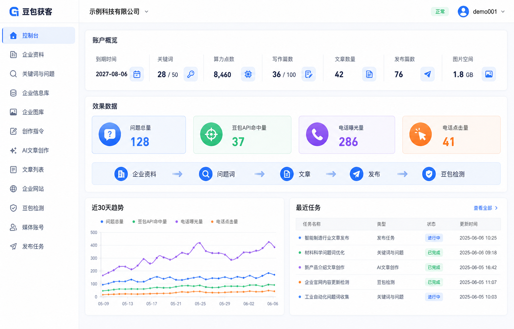
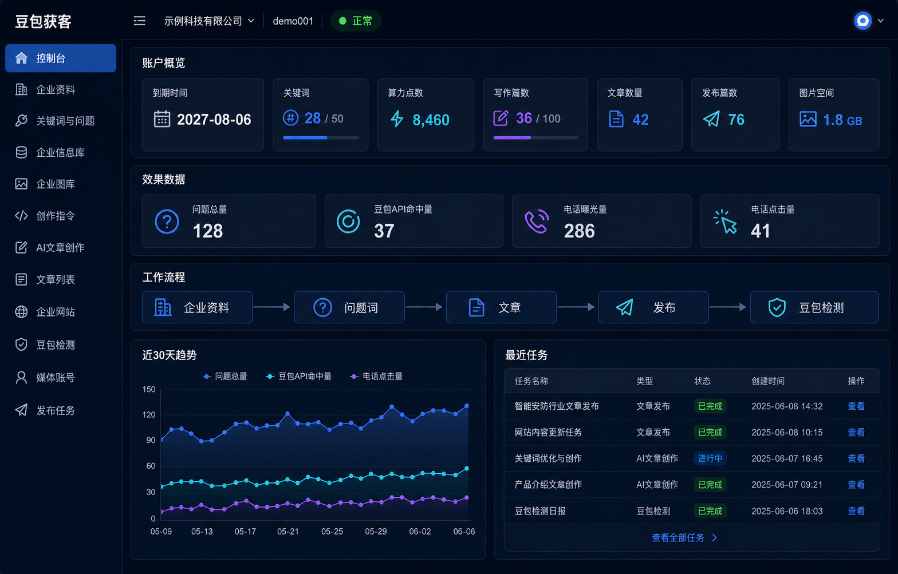
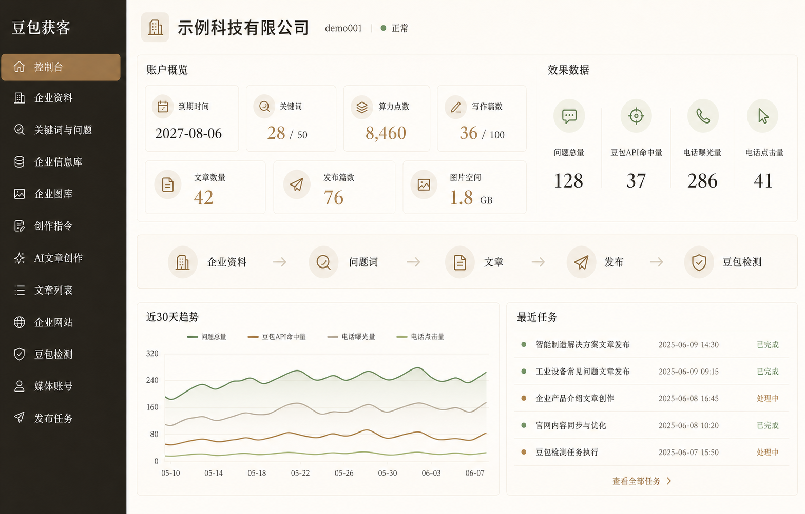
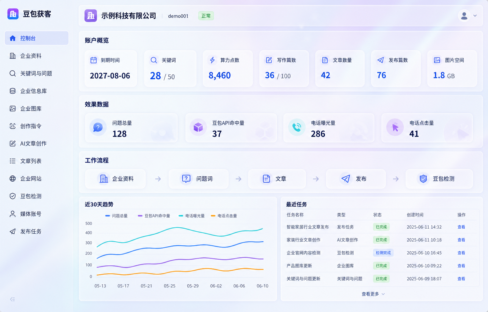
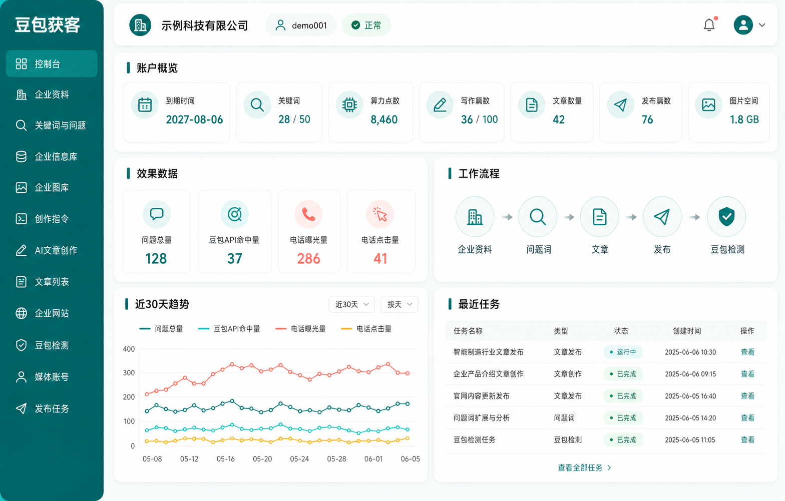

# UI 风格提案归档（V1）

> 版本：V0.1  
> 日期：2026-08-06  
> 状态：已于 2026-08-06 否决，仅供设计回溯，禁止作为前端实现依据

新版现代化提案见：[V2 Modern](./v2-modern/README.md)。V2 不再沿用“传统宽侧栏 + 等宽数据卡片”的后台模板骨架，而是从导航、数据层级和页面构图上重新设计。

## 1. 设计范围

五套图片都使用同一份普通商户网页客户端控制台信息架构，只改变视觉系统，不改变功能、权限和数据口径。正式开发时系统昵称与 Logo 从总后台品牌配置读取，图中的“豆包获客”只是临时占位名称。

统一内容包括：

- 左侧十二项业务导航。
- 账户、到期时间、关键词、算力点数、写作篇数、文章数量、成功发布篇数和图片空间。
- 问题总量、豆包收录数、电话曝光量、电话点击量。
- “企业资料 → 问题词 → 文章 → 发布 → 豆包检测”流程。
- 最近 30 天趋势和最近任务。

## 2. 五套方案

| 编号 | 风格 | 特点 | 前端落地成本 | 建议 |
|---|---|---|---:|---|
| 01 | 清爽企业蓝 | 信息密度合理、层级直接、最接近成熟 SaaS | 低 | 追求尽快落地时首选 |
| 02 | 深色科技 | 对比强、技术感明显，适合长时间桌面操作 | 中 | 需要额外完成暗色可读性测试 |
| 03 | 暖色高级 | 品牌感强、克制稳重，适合高客单企业服务 | 中 | 需要严格控制字体和留白 |
| 04 | 轻玻璃极光 | AI 感最强、视觉辨识度高 | 较高 | 首版不建议大量使用模糊和透明层 |
| 05 | 清新青绿 Bento | 现代、友好、模块清楚，兼顾轻量和差异化 | 中低 | 适合作为 01 的现代化备选 |

### 01 清爽企业蓝

### 02 深色科技

### 03 暖色高级

### 04 轻玻璃极光

### 05 清新青绿 Bento

## 3. 提示词基线

所有图片均通过内置 ImageGen 生成，使用`ui-mockup`类型。共享提示要求为：完整 16:10 桌面应用画布、固定侧栏和顶栏、生产级 SaaS 布局、中文原文可读、无浏览器外壳、无城市地图、无 AI 来源猜测、无在线人数噱头、无商标和水印。

五套差异提示分别为：

1. 白色与浅灰背景、`#3478F6`企业蓝、细边框、10px圆角和轻阴影。
2. 深海军蓝画布、蓝青紫有限强调、清晰白字、克制发光效果。
3. 暖象牙白、深咖侧栏、哑光铜色与鼠尾草绿、编辑式排版。
4. 淡蓝紫极光背景、磨砂白面板、钴蓝和紫色强调，同时保持高对比。
5. 柔和灰白、深青绿与薄荷绿、16px圆角、模块化 Bento 网格。

## 4. 使用边界

- 这些图片用于确定视觉方向和页面层级，不是可直接上线的前端截图。
- 选定风格后再建立颜色、字体、间距、圆角、阴影和状态色设计变量。
- 正式页面必须以产品需求和接口契约为准，不从图片反推或新增业务功能。
- 第一版不混搭五套风格；最多选择一套主风格，并从另一套吸收少量明确组件。
