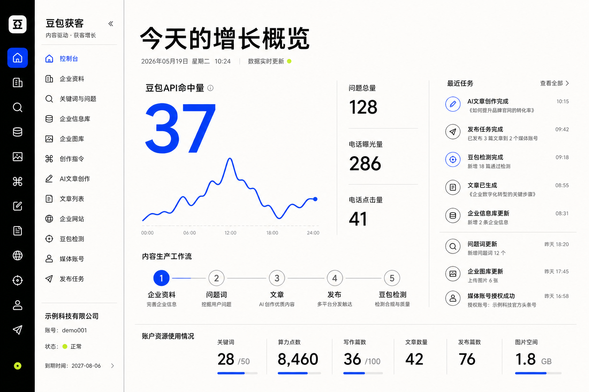
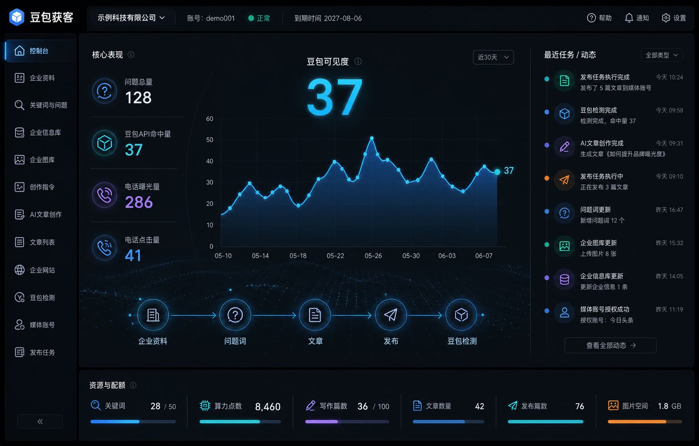
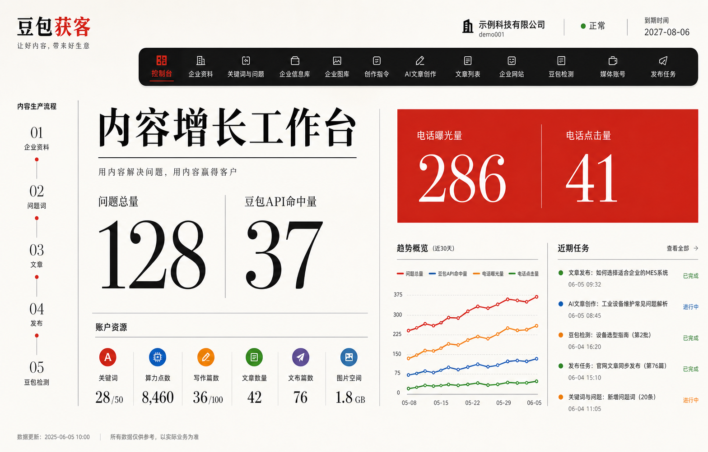
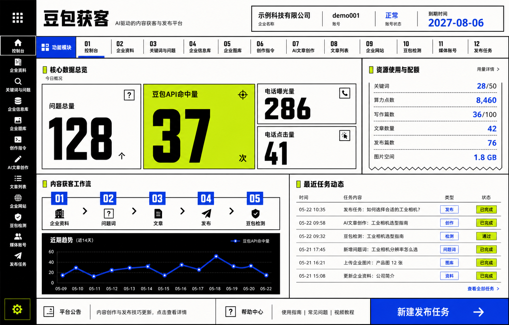
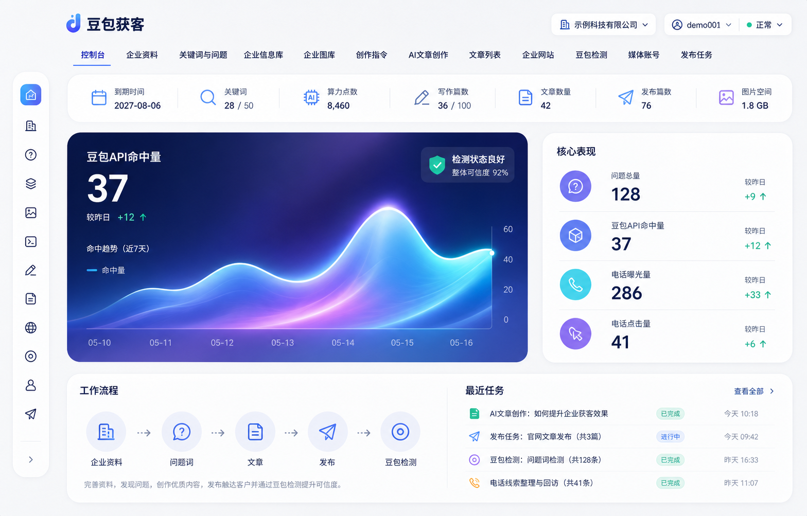

# UI 现代化提案（V2）

> 版本：V0.2  
> 日期：2026-08-06  
> 状态：待用户选择；尚未转为前端代码

## 1. 改版原则

- 不再使用传统宽侧栏与等宽 KPI 卡片阵列。
- 首屏只突出一个核心判断，其余指标按层级收纳。
- 五套方案改变的是导航方式、信息层级与构图，不是只换配色。
- 保留普通商户控制台的真实数据与必要流程，不增加无业务价值的装饰模块。
- 图片仅用于确认视觉方向；正式实现使用真实中文、组件和响应式布局。

## 2. 五套结构方案

| 编号 | 方向 | 核心结构 | 现代感 | 落地风险 | 结论 |
|---|---|---|---:|---:|---|
| 01 | 编辑指挥台 | 浮动图标轨 + 巨型核心指标 + 编辑式任务流 | 高 | 低 | 信息最克制，适合继续深化 |
| 02 | 暗色数据 OS | 顶部命令栏 + 一体化数据画布 + 右侧活动流 | 高 | 中 | 技术感强，适合桌面端重度使用 |
| 03 | 杂志式留白 | 顶部胶囊导航 + 巨型排版 + 非对称内容网格 | 很高 | 中 | 品牌辨识度最高，但需控制字体与密度 |
| 04 | 新粗野主义 | 工具轨 + 模块索引 + 强边框非对称网格 | 很高 | 中 | 个性最强，不适合作为保守型贴牌默认皮肤 |
| 05 | AI 原生极简 | 稀疏顶栏 + 单一极光主画布 + 集成工作流 | 高 | 低 | 现代与易用平衡最好，推荐作为实现基线 |

### 01 编辑指挥台

### 02 暗色数据 OS

### 03 杂志式留白

### 04 新粗野主义

### 05 AI 原生极简

## 3. 共同业务基线

- 账户：企业、账号、状态、到期时间。
- 资源：关键词、算力点数、写作篇数、文章数量、发布篇数、图片空间。
- 数据：问题总量、豆包收录数、电话曝光量、电话点击量。
- 流程：企业资料 → 问题词 → 文章 → 发布 → 豆包检测。
- 内容：近期趋势、最近任务和全部十二项业务模块入口。

## 4. 推荐决策

优先从 `05 AI 原生极简`继续做可编码线框和组件规范；若希望品牌更大胆，可用`03 杂志式留白`的字体层级与留白方式增强 05。不要直接把两套配色和组件混在一起。

## 5. 生成与使用边界

- 五张概念图均由内置 ImageGen 独立生成，原始生成文件保留，工作区只保存副本。
- 生成图可能存在日期或少量文字偏差，不构成产品字段定义。
- 选型后需在真实前端中重新建立设计变量、组件状态、表格与表单规范，并验证 1440px、1366px 和小尺寸桌面窗口。
