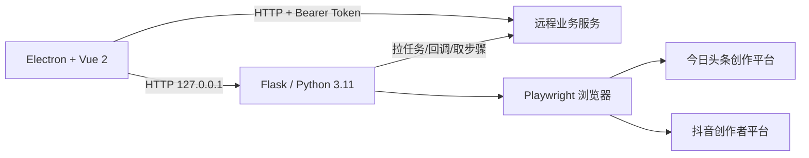

# auth helper 2.12.6 参考程序分析

分析日期：2026-08-08

## 1. 分析边界

- 安装包：`auth helper Setup 2.12.6.exe`
- 安装包 SHA256：`0CC48105E95992C7E8A0D746CA4B5B9ADC89E0795566F80404864766E5603FD9`
- 安装目录：`D:\auth-helper-reference\2.12.6`
- 静态分析目录：`D:\auth-helper-reference\analysis`
- 安装包、Electron 主程序和 Python 本地服务均无数字签名。
- 运行只用于确认进程、端口和网络行为；未登录媒体账号，未导入 Cookie，未执行发布任务。动态证据收集后已关闭全部参考程序进程，`5000` 端口已停止监听。

## 2. 已验证架构

主要组件：

- Electron 主进程：`resources/app.asar/electron/main.js`
- Vue 2 渲染层：`resources/app.asar/vue-dist`
- 前端 API 封装和登录脚本：`resources/app.asar/src/api`
- Python 本地服务：`resources/main/main.exe`
- Python 自动化核心：PyInstaller 包内 `src/push_script.pyc`
- 平台默认步骤：PyInstaller 包内 `src/script/toutiao.pyc`、`src/script/tiktok.pyc`

本地服务使用 Flask、Playwright、playwright-stealth；Electron 通过 `/api/push`、`/api/logs/{taskId}`、`/api/media/login` 等接口调用它。

## 3. 真实任务链路

### 3.1 客户端登录

1. Electron 向远程 `/api/zhushou/login` 提交用户名、密码、授权码和实例数。
2. 返回 Token 写入 Electron 渲染层 `localStorage`。
3. 勾选“记住登录”时，用户名、密码、授权码会原样写入 `localStorage.savedLoginData`，有效期逻辑为 30 天。

### 3.2 媒体账号授权

1. 每次打开授权页生成新的 WebView 分区名 `session_<timestamp>_<random>`。
2. WebView preload 脚本判断抖音/头条登录状态，并读取页面可见账号信息。
3. 关闭授权窗口时，Electron Session API 读取该分区全部 Cookie。
4. Cookie 被 URL 编码后提交给远程 `/api/zhushou/save_cookie`。
5. 发布时 Python 服务从任务里的 `states` 地址下载 storage state，再注入 Cookie、localStorage 和 sessionStorage。

结论：它的账号隔离思路是“临时 WebView 分区 + 云端保存浏览器状态”，不是“每个账号一个本机持久浏览器目录”。

#### 3.2.1 登录后实际上传字段复核（2026-08-08）

通过安装包自带 source map 还原 `Home.vue` 后，可以确认头条、抖音新增授权关闭 WebView 时的真实客户端行为：

1. 使用 `session.fromPartition(sessionPartition).cookies.get({})` 读取该临时 Electron 分区的全部 Cookie，而不是只读取 `document.cookie`。因此上传数组可以包含 HttpOnly Cookie，并保留 Electron Cookie 对象中的 `name`、`value`、`domain`、`hostOnly`、`path`、`secure`、`httpOnly`、`session`、`sameSite`、`expirationDate` 等属性。
2. Cookie 数组先 `JSON.stringify`，再 `encodeURIComponent`，作为 `cookie` 字段提交到 `/api/zhushou/save_cookie`。
3. 同一请求还包含 `nickname`、`avatar`、`status`、`platform`、`unique_id`、`state`、`follower_count`、`following_count`、`total_favorited`、`udid`、`uid`。其中 `state` 在这条前端流程中初始化为空字符串；头条/抖音 preload 读取的 `document.cookie` 会在关闭 WebView 时被 Electron Session API 取得的完整 Cookie 数组覆盖。
4. 再次打开账号时，客户端从账号列表的 `cookies` 字段下载上述 Cookie 数组，创建新的临时分区并逐个调用 Electron `cookies.set`。可见账号查看/复用链路在客户端侧明确只恢复 Cookie，不恢复完整浏览器 Profile。
5. Python 发布器还支持另一种任务字段：`states` 是远程 storage-state 文件地址，抖音等平台会下载该文件并作为 Playwright `storage_state` 创建 Context；另一个兼容分支会解析含 `cookies`、`origins[].localStorage` 和自定义 `origins[].sessionStorage` 的结构并逐项注入。

安装包不包含远程 `/api/zhushou/save_cookie` 的服务端源码，因此无法证明服务器是否在保存后补建 LocalStorage/SessionStorage、`states` 文件如何生成、数据库是否加密，以及两种任务字段是否始终来自同一份授权数据。能够确认的是：新增头条/抖音授权的客户端上传请求本身只有“全部 Cookie + 账号/用户元数据”，没有发现直接上传 LocalStorage、SessionStorage、IndexedDB 或完整浏览器目录的代码。此前“上传完整 storage state”的表述应按本节细化，不能把发布器的兼容读取能力等同于登录上传字段。

### 3.3 发布调度

1. Electron 调用本地 `/api/push` 启动任务。
2. Python 服务循环请求远程 `/index/send/send` 拉取待发布数据。
3. 每次返回的数据列表中，每一项直接创建一个 Python `Thread`。
4. 每个线程创建独立 `Push` 对象和独立 Playwright 浏览器。
5. 下载远程 storage state，注入浏览器上下文。
6. 获取远程步骤列表或使用本地默认步骤，执行页面自动化。
7. 发布完成后调用远程 `/index/send/send_callback` 回传结果。
8. 所有线程 `join` 后等待发布间隔，再继续拉取下一批。

这属于“批次内全并发、批次间串行轮询”，没有看到线程池、账户级互斥或明确并发上限。

### 3.4 步骤解释器

`Push.execute_step` 是通用动作解释器，支持：

- navigate、wait_for_url、wait_for_selector
- click、hover、fill、press、input_files
- iframe、while、branch、tags
- 定时发布控件
- 坐标点击
- 页面 JavaScript evaluate 和剪贴板 HTML 注入

远程服务可通过 `/api/zhushou/get_step_list` 下发步骤，默认平台步骤也内置在程序中。这能热修选择器，但远程动作能力过大。

## 4. 抖音和头条默认流程

### 今日头条

- 打开 `https://mp.toutiao.com/profile_v4/graphic/publish`
- 填标题和正文
- 选择单图、上传图片并确认
- 可取消首发、声明 AI、设置定时发布
- 点击“预览并发布”后点击“确认发布”
- 等待跳转到 `https://mp.toutiao.com/profile_v4/graphic/articles`

### 抖音

- 打开 `https://creator.douyin.com/creator-micro/content/upload?default-tab=3`
- 上传图片
- 填写标题、话题、地点或商品链接
- 可勾选 AI 内容声明
- 点击“发布/直接发布”
- 等待跳转到 `https://creator.douyin.com/creator-micro/content/manage?enter_from=publish`

它的成功判断主要依赖后台管理页跳转，不是公开作品 URL。断网、页面延迟或平台已收稿但回跳失败时，存在误判和重复发布风险。

## 5. 多账号和多客户能力评价

### 已具备

- 支持一个客户绑定多个平台账号。
- 一个发布批次可为多个数据项分别启动浏览器线程。
- Electron 允许多开，并用 `instances.json` 统计进程数量。
- 每次媒体授权使用不同 WebView Session 分区。

### 不适合直接照搬

- 多个 Electron 实例仍共享同一个 `app.getPath('userData')`，主窗口 Token、登录资料和配置可能互相覆盖，不构成可靠的客户隔离。
- 批次内线程数等于远程返回数据量，没有有界并发；账号多时容易造成 CPU、内存和浏览器进程爆发。
- 没有“同一客户串行、不同客户有限并行”的调度约束。
- 没有任务租约、幂等键、平台成功链接先本地落盘再回调等防重复机制。

## 6. 安全与稳定性问题

### P0

1. Flask 监听 `0.0.0.0:5000`，而不是 `127.0.0.1`；同一局域网设备可能访问发布、授权和清理接口。
2. 远程业务接口基址为明文 HTTP，Token、任务、Cookie 状态地址和回调均缺少传输层保护。
3. Electron 使用 `webSecurity:false`、`nodeIntegration:true`、`contextIsolation:false`、Remote Module 和 WebView，渲染层一旦被注入，影响可扩展到本机文件和进程。
4. “记住登录”把明文密码保存在 localStorage；调试日志还直接打印 Cookie、代理用户名和密码。

### P1

1. 安装包、Electron 主程序和 Python 服务均无数字签名。
2. 远程步骤 DSL 支持任意页面 JavaScript、导航、文件上传和坐标点击，缺少签名、版本锁定和动作白名单。
3. 无界线程并发会放大资源耗尽和平台风控风险。
4. 浏览器参数关闭 Web Security、Safe Browsing 更新等能力，风险高于必要范围。
5. Cookie 和完整 storage state 上传到对方服务器，账号风险集中在服务端。
6. Electron IPC 删除分区目录的参数缺少严格目录名白名单校验。

## 7. 在线更新实现

- `app-update.yml` 仍是占位 GitHub 配置：`your-github-username/your-repo-name`。
- 实际逻辑从远程 `/api/zhushou/get_update_log` 获取版本号和 EXE 下载地址。
- 更新按钮只是打开下载地址，不执行受控的自动安装。
- 未看到下载前 SHA256、发布者签名、证书绑定、回滚或灰度策略。

因此它不是真正安全可靠的在线更新方案，不能作为我们的实现基线。

## 8. 对豆包获客发布助手的取舍

### 可以借鉴

1. 网页 SaaS 负责任务和内容，本地客户端负责浏览器执行。
2. 每个媒体账号使用独立浏览器状态。
3. 服务器任务拉取、执行日志和结果回调三段式链路。
4. 抖音、头条分别维护独立平台适配器。
5. 已知提示弹窗自动关闭，验证码/风控才转人工。
6. 选择器需要版本化和可热修。

### 必须重做

1. 保持当前项目的 Electron + TypeScript + Playwright 单技术栈，不增加 Python/Flask sidecar。
2. 媒体 Cookie 和浏览器 profile 只存本机；服务端只存账号元数据和授权状态。
3. profile 路径继续使用 `workspace/platform/media-account` 三级隔离。
4. 同一商户严格串行，不同商户采用有界并行；默认并发建议 2，后续按机器资源自适应，不能无界创建线程。
5. 平台适配器使用类型化动作和本地代码；远程只允许下发签名后的选择器清单和开关，不允许下发任意 JS。
6. 成功必须取得可验证的官方公开链接，先本地持久化，再回调任务服务；回调失败不得再次发布。
7. 本地若需 HTTP 服务，只监听随机 loopback 端口，并对每次请求校验短期本机令牌；当前项目不需要额外本地 HTTP 服务。
8. Token 使用 Windows `safeStorage`，渲染层不得读取；不保存明文密码。
9. 在线更新继续使用可信 HTTPS 源、版本递增、SHA256/签名校验和用户确认安装。

## 9. 当前结论

参考程序证明了“云端派单 + 本地 Playwright + 多媒体账号”路线可行，也提供了抖音、头条页面动作参考。但它的安全边界、客户隔离、并发控制、成功幂等和在线更新都达不到本项目要求。

项目应只吸收其业务流程，不应复制其 Electron 安全配置、云端 Cookie 保存、无界多线程、远程任意步骤执行或明文 HTTP 架构。
