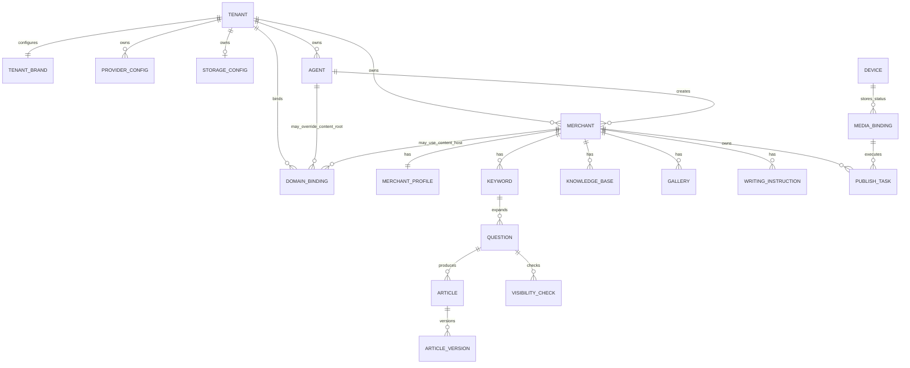

# 系统架构说明

> 版本：V0.7  
> 状态：技术栈已确认，细节随阶段评审更新  
> 上级文档：[项目计划总纲](../PROJECT_MASTER_PLAN.md)

## 1. 架构目标

- 普通商户网页客户端、EXE 发布助手、总后台、贴牌/代理管理端四个应用明确隔离。
- 前期本地开发，不依赖正式服务器。
- 先通过共享契约和Mock确认两个客户端，再实现真实后台。
- V1采用模块化单体，避免微服务部署成本。
- 对AI生成、豆包查询、静态建站和发布任务提供可恢复的异步执行。
- 平台提供SaaS服务器与任务编排，贴牌提供大模型和对象存储资源，所有下级统一继承贴牌资源。
- 媒体账号可移植会话包允许以平台 KMS 信封加密密文进入云端；会话包固定覆盖完整 Cookie 属性、相关 Origin 的 LocalStorage、SessionStorage 和 IndexedDB。明文凭证、完整浏览器资料和平台账号密码不得持久化或进入网页端。

## 2. 已确认技术栈

| 层 | 技术 | 说明 |
|---|---|---|
| 工作区 | pnpm workspace | 单仓库管理，应用独立构建 |
| 网页客户端 | Vue 3 + Vite + TypeScript | 普通商户业务端 |
| 状态与路由 | Pinia + Vue Router | 只保存业务状态，不保存敏感凭证 |
| UI基础 | Element Plus + 自定义设计变量 | 复用成熟表单、表格和弹窗 |
| EXE | Electron + Vue 3 + TypeScript | Windows本地发布助手 |
| 浏览器执行 | Playwright | 独立持久化Chrome/Edge资料目录 |
| 总后台 | Vue 3 + Vite + TypeScript | 平台专用独立应用和认证入口 |
| 贴牌/代理管理端 | Vue 3 + Vite + TypeScript | 贴牌与代理共用应用，服务端角色菜单不同 |
| API | NestJS + Fastify | 模块化单体、OpenAPI |
| ORM/数据库 | Prisma + PostgreSQL | 类型安全查询和版本化迁移 |
| 队列 | BullMQ + Redis | AI、检测、建站、发布协调 |
| 接口契约 | OpenAPI | 自动生成客户端类型和Mock |
| Mock | MSW + 本地任务适配器 | 前期不需要真实服务器 |
| 静态网站 | Nunjucks + HTML/CSS | 三套模板共用渲染核心 |
| 对象存储 | 本地MinIO；正式环境贴牌自备阿里云OSS | 通过存储适配器和短时上传授权接入 |
| 测试 | Vitest + Playwright + API集成测试 | 页面、接口、权限、安装包 |
| 本地基础设施 | Docker Compose | PostgreSQL、Redis、MinIO |

依赖版本在创建工程时从官方稳定版本中选择并锁定，不使用`latest`漂移运行。Electron只选官方仍支持的稳定主版本。

## 3. 为什么采用该方案

- Vue、Electron、NestJS都使用TypeScript，接口类型和工程规范可复用。
- 网页客户端是登录后的业务SPA，不需要Next.js服务端渲染。
- 企业公开网站由专用静态生成器输出，不依赖Vue运行时，更利于抓取和节省资源。
- Electron虽然安装包较大，但能快速复用网页UI和Node版Playwright，V1效率高于Tauri加Node Sidecar。
- AI接口本质为HTTP调用，V1不为此增加Python技术栈。
- NestJS配合BullMQ适合有进度、重试、恢复和状态事件的长任务。

官方参考：

- [Vue TypeScript指南](https://vuejs.org/guide/typescript/overview)
- [Electron安全指南](https://www.electronjs.org/docs/latest/tutorial/security)
- [Playwright持久化浏览器上下文](https://playwright.dev/docs/api/class-browsertype#browser-type-launch-persistent-context)
- [NestJS队列](https://docs.nestjs.com/techniques/queues)
- [Prisma ORM](https://www.prisma.io/docs/orm)

## 4. 计划目录结构

```text
doubaohk/
├─ apps/
│  ├─ merchant-web/          普通商户网页客户端
│  ├─ publisher-desktop/     EXE发布助手
│  ├─ super-admin-web/       总后台
│  └─ tenant-admin-web/      贴牌/代理共用管理端
├─ services/
│  ├─ api/                   NestJS模块化单体API
│  ├─ worker/                BullMQ任务执行器
│  └─ site-renderer/         三套静态网站模板生成器
├─ packages/
│  ├─ api-contract/          OpenAPI和生成类型
│  ├─ provider-adapters/     大模型平台协议适配与能力测试
│  ├─ storage-adapters/      MinIO、阿里云OSS及后续S3适配
│  ├─ ui-tokens/             无业务权限的颜色、间距、字体变量
│  ├─ eslint-config/         共享代码规范
│  └─ test-fixtures/         无敏感数据的测试样本
├─ infra/
│  ├─ docker/                本地PostgreSQL/Redis/MinIO
│  └─ scripts/               本地启动、检查、迁移脚本
├─ docs/
└─ PROJECT_MASTER_PLAN.md
```

`merchant-web`、`super-admin-web`和`tenant-admin-web`不能共享页面、业务路由、权限 Store 和登录会话；只允许共享无业务含义的设计变量、基础组件及接口类型。贴牌与代理在`tenant-admin-web`内共用认证入口，但权限仍由后端按角色和租户校验。

## 5. 应用边界

### 5.1 网页客户端

- 只面向普通商户。
- 左上角品牌通过当前访问域名和认证上下文解析所属贴牌，商户不能覆盖。
- 负责内容和网站业务操作。
- 控制台展示账户、期限、关键词/文章用量、算力点数、写作额度、成功发布篇数、图片存储空间及四项效果数据，全部来自后端可追溯统计。
- 通过API创建发布任务，但不执行浏览器自动化。
- 可以显示媒体账号状态，但看不到Cookie和本地路径。
- 不包含开通代理、额度管理、AI密钥等管理能力。
- 豆包检测页面只读展示当前商户结果，不能创建单户或批量检测任务。

### 5.2 EXE发布助手

- 只运行在Windows商户电脑。
- 使用设备凭证绑定一个商户。
- 负责多商户一次登录、扫码、持久化本地平台会话、批量任务调度、全自动执行、结果核验和回传。
- 不编辑企业资料和文章正文。
- 不加载具有Node权限的远程网页。

### 5.3 总后台

- 平台专用独立应用、域名和认证受众，只允许总后台角色登录。
- 负责开通贴牌、设置贴牌系统昵称/Logo、绑定四类域名、全局额度、租户树、任务运维与审计。
- 不加载贴牌/代理菜单，也不共享其他网页应用登录 Cookie。
- 不接收媒体Cookie和浏览器资料。

### 5.4 贴牌/代理管理端

- 一个独立应用，贴牌和代理共用域名入口及登录页。
- 登录成功后，服务端返回角色、权限集合、所属贴牌和品牌上下文；前端据此生成菜单。
- 贴牌和代理左上角只显示总后台设置的继承品牌，不提供修改入口。
- 贴牌角色可以管理本贴牌大模型 API、对象存储、代理、商户和额度；代理只能管理自己创建的普通商户和可分配额度。
- 只有贴牌角色可以选择所属单个商户或全部商户创建豆包 API 检测任务；代理只读自身商户汇总，不能发起检测。
- 后端逐接口执行角色和租户校验，不能把前端路由守卫当作权限边界。
- 不共享商户网页端或总后台登录 Cookie，不接收媒体 Cookie 和浏览器资料。

### 5.5 后端API

- 一个部署单元，内部按模块隔离。
- 负责鉴权、租户边界、业务规则和任务协调。
- 客户端提交的`tenant_id`、`merchant_id`不能直接作为授权依据，必须从认证上下文解析并校验。

### 5.6 Worker

- 执行DeepSeek生成、豆包检测、静态站生成等长任务。
- 每类任务有独立队列、并发、超时、重试和死信处理。
- Worker不能直接绕过业务服务修改状态。

### 5.7 静态网站生成器

- 接收已审核的结构化网站快照。
- 输出纯静态HTML、CSS、图片引用、站点地图和结构化数据。
- 三套模板使用相同数据契约。
- 生成失败时保留上一版可用网站，不发布半成品。

## 6. 后端模块划分

V1模块化单体至少包含：

- Identity：用户、会话、密码、设备绑定。
- Tenancy：贴牌、代理、商户、上下级关系。
- Branding：平台默认品牌、贴牌品牌配置、版本和继承解析。
- Domain：总后台、贴牌/代理管理端、商户网页客户端、企业内容站根域名/商户站点主机名、验证、证书和绑定状态。
- Entitlement：可开代理数、普通商户席位、期限、关键词上限、算力点数、写作篇数、可选存储上限和功能开关。
- UsageMeter：席位预留、关键词、文章、图片对象、算力点数、写作篇数及成功发布数的可追溯用量账本与校准状态。
- ProviderConfig：大模型平台、协议、模型、用途分配、能力测试与继承。
- StorageConfig：对象存储凭证、Bucket、前缀、公开域名、测试与继承。
- MerchantProfile：企业事实资料和版本。
- KeywordQuestion：关键词、问题词和去重。
- ContentLibrary：信息库、图库、创作指令。
- Generation：创作任务、单篇明细、文章版本。
- Website：模板、商户站点地址、生成记录和发布快照。
- Visibility：仅贴牌可创建的豆包检测批次、单商户任务、问题明细和命中结果；商户只读自身结果。
- MediaBinding：设备、平台账号状态，不含Cookie。
- Publishing：发布任务、租约、步骤和结果。
- Analytics：电话曝光、电话点击和每日汇总。
- Audit：关键操作审计和安全事件。

模块只能通过公开服务或领域事件交互，不能跨模块直接修改数据库表。

## 7. 核心数据关系



所有业务表使用不可猜测主键并包含创建、更新时间。需要租户隔离的表必须同时包含`tenant_id`和`merchant_id`或可安全追溯的父级关系。

### 7.1 分级开户与额度

- 贴牌与代理账号在`tenant-admin-web`登录域内使用规范化后的全局唯一索引；商户用户名在`merchant-web`登录域内使用另一条全局唯一索引。规范化至少包含去除首尾空白和忽略大小写。
- 所有下级账号密码按产品要求校验`^[A-Za-z0-9]{6,12}$`，只保存带独立盐值的 Argon2id 密码哈希；原文不得进入数据库、队列、日志或审计详情。
- 总后台开贴牌事务同时写入租户、主管理账号、可开代理数、普通商户总席位、算力点数、写作篇数、期限和内容站根域名继承状态。
- 贴牌开代理事务同时校验可开代理数并从贴牌预留普通商户席位、算力点数和写作篇数；代理到期时间不得超过贴牌。
- 贴牌或代理开商户事务同时写入商户、归属关系、期限、关键词上限、算力点数和写作篇数账本，并占用正确层级的一个普通商户席位；任一步失败全部回滚。
- 代理创建商户前必须解析有效的上级贴牌；不存在上级贴牌或贴牌资源状态异常时拒绝开户。
- 未关闭账号继续占用代理或商户席位，到期和停用不自动释放；明确关闭后通过审计事务返还。
- 算力点数和写作篇数分别使用不可变流水与余额快照，分配和消费接口带幂等键，不能通过直接更新余额绕过审计。
- 发布不设额度；`Publishing`按成功渠道结果累计发布篇数，同一文章在两个平台成功产生两条结果。
- 自定义域名录入只创建待验证绑定。商户留空时按`merchant → agent有效内容根域名? → tenant有效内容根域名? → platform内容根域名`分配唯一二级域名。

### 7.2 品牌解析

- 只在平台级和贴牌级保存品牌配置，且只有总后台角色拥有写权限；不建立代理级或普通商户级品牌表。
- 普通商户由代理创建时，沿`merchant → agent → tenant`解析；由贴牌直接创建时，沿`merchant → tenant`解析。
- 解析结果至少包含`system_name`、`logo_asset_id`和`brand_version`；缺失时回退平台默认品牌。
- 企业公开网站读取`merchant_profile`中的公司名称和企业 Logo，不能读取`tenant_brand`代替企业品牌。

### 7.3 域名解析

- `domain_binding`必须包含用途枚举，V1 至少有`SUPER_ADMIN_ACCESS`、`TENANT_ADMIN_ACCESS`、`MERCHANT_APP_ACCESS`、`CONTENT_SITE_ROOT`和`CONTENT_SITE_HOST`。产品层仍归为四类入口，其中“企业内容站”类包含根域名和最终商户站点主机名两个技术子类型。
- `CONTENT_SITE_ROOT`绑定同时保存所有者类型与ID，可属于平台、贴牌或代理；代理未配置或未启用时回退贴牌，贴牌未配置时回退平台。
- 请求 Host 只与已验证且已启用的域名绑定匹配；未知 Host 拒绝或进入固定平台入口，不能靠请求参数选择租户。
- 同一规范化域名建立数据库唯一约束。换绑使用“待验证 → 待证书 → 待切换 → 已启用/失败”状态机，并保留上一条可用绑定。
- 品牌解析结果可以短时缓存，但以`brand_version`失效，避免每个静态资源请求查询数据库。

## 8. 接口契约

### 8.1 Contract First

- 先写OpenAPI，再写Mock和页面。
- 响应结构、分页、错误码和枚举集中定义。
- TypeScript类型由契约生成，禁止手工复制一套近似类型。
- 契约破坏性修改必须提升API版本或提供兼容期。

### 8.2 通用响应

业务成功返回明确数据；业务失败使用稳定错误码、用户可读信息和`request_id`。日志使用`request_id`关联，前端不展示堆栈。

### 8.3 分页和时间

- 列表默认服务端分页。
- 数据库存储UTC时间。
- 界面按租户时区展示，V1建议默认`Asia/Shanghai`。
- 时间格式与时区不能由每个页面自行处理。

## 9. 异步任务与防重复

### 9.1 通用任务字段

- 任务类型、归属商户、状态、进度。
- 幂等键、尝试次数、最大重试。
- 创建、开始、心跳、结束时间。
- 错误码、脱敏错误信息和结果引用。

### 9.2 幂等

- 创建任务使用业务幂等键，网络重试不能创建重复任务。
- AI单篇生成、豆包检测和静态站发布分别有独立幂等规则。
- 媒体发布成功后禁止自动重试最终提交步骤。

### 9.3 发布租约

EXE领取发布任务时获得有过期时间的租约并持续心跳。其他设备不能同时执行。租约过期只允许进入人工确认或安全恢复，不能盲目重复发布。

### 9.4 批次调度与去重

- 网页端创建发布批次，服务端在串行化事务中按文章与目标媒体账号拆分任务并计算计划时间。
- 数据库为“商户 + 文章 + 平台”建立基础唯一约束，保证单平台去重；全平台去重在串行化事务中锁定文章并检查该文章任意平台任务。接口幂等键只解决请求重试，不能替代业务去重。
- 多个目标账号只参与任务分配：同平台文章按有效账号轮询，最终任务固定一个 `mediaAccountId`，不将同一篇文章广播给同平台全部账号。
- 头条、抖音每日默认各 3 篇，允许商户分别调高；调度器只把到期任务暴露给 EXE。
- 最终发布步骤是不可安全重试边界。适配器只有在明确证明未提交时才能继续；提交后状态未知必须转人工核验。

## 10. 媒体登录和本地安全

### 10.1 浏览器资料

- 头条、抖音、不同商户和不同账号使用独立`userDataDir`，目录键为不可猜测的商户工作区引用与平台，不能直接使用用户名。
- 资料目录位于当前Windows用户专用应用数据目录。
- 当前 G2 已使用 Playwright 持久化 Chrome/Edge 资料目录实现商户、平台、媒体账号三级隔离；自动化执行器复用同一资料目录。
- 登录能力验证成功后，主进程从对应 BrowserContext 导出 Playwright `storageState({ indexedDB: true })`，另行采集每个允许 Origin 当前页面的 SessionStorage，合并为版本化可移植会话包。Cookie 保留完整属性，LocalStorage、SessionStorage、IndexedDB 均保留 Origin 归属；按平台域名白名单过滤并限制条目数、单值大小和总字节，再通过已认证的 HTTPS 发布助手 API 上传。Renderer、网页端和日志均不能接触会话内容。
- 服务端为每次备份生成随机 256 位数据密钥，以 AES-256-GCM 和绑定租户、商户、平台、媒体账号、内容版本的 AAD 加密会话；数据密钥由平台托管 KMS 包装。数据库保存密文、包装后的数据密钥、nonce/tag、KMS 提供方与密钥版本、校验和、来源设备、备份/恢复/撤销时间。
- 新设备只在登录同一商户发布助手后请求恢复。服务端完成租户、设备、账号归属和撤销状态校验后，在内存中解密并通过 HTTPS 返回；主进程写入该账号独立 BrowserContext 后立即访问发布页验证。失败时清除本次恢复结果并要求扫码。
- 当前 Windows 用户的商户设备令牌和本地敏感元数据继续使用 `safeStorage`；云备份不替代本地资料目录，也不保证第三方平台接受跨设备会话。
- 不备份完整 `userDataDir`、Cache、Service Worker 文件、浏览历史、下载、扩展、二维码临时态、平台账号密码或真实 WebAuthn 私钥。

### 10.4 单实例多商户执行器

- Windows 只运行一个发布助手主进程；单实例负责多个商户工作区，避免多进程同时打开同一持久化资料目录。
- EXE 登录可以保存多个商户设备会话。每个会话由同一网页账号密码首次换取，随后以 Windows 用户级安全存储保存独立、可撤销设备令牌；渲染层不能读取令牌。
- 应用启动路由由主进程基于安全存储中的有效工作区数量决定：`0` 个进入独立登录页，`1` 个直接进入该工作区，`2+` 个进入工作区选择页。业务 Renderer 不保存密码，媒体账号、任务与日志页不渲染登录表单。
- 工作区退出只撤销对应商户的本机设备会话与运行队列，不清除其他商户的令牌或浏览器资料；清除媒体浏览器资料必须另行显式确认。
- 网页深链使用一次性或短时配对票据定位商户工作区，禁止携带账号密码、Cookie、长期 Token、文章正文或图片地址。
- 调度器按商户建立串行队列，并对每个媒体账号建立独立资料锁；同一商户所有账号逐条执行，不同商户可以并行，并发上限由本机资源和平台风控配置控制。
- 平台适配器分为预检、素材准备、表单填写、最终提交、结果核验五个阶段。只有所有阶段后置条件满足才写成功；验证码和未知页面转人工处理。

### 10.2 Electron隔离

- `nodeIntegration`关闭。
- `contextIsolation`和sandbox开启。
- Preload只暴露白名单API并校验参数。
- IPC校验发送方和数据结构。
- 远程平台页面由Playwright控制的独立浏览器打开，不在高权限Renderer内执行。

### 10.3 后端设备记录

后端保存设备ID、商户、平台、脱敏账号、状态、最后验证、心跳、版本和 KMS 信封加密的可移植会话包。同一设备可与多个商户建立独立绑定，但每个商户只有一个活动设备。明文 Cookie/Token、本地路径、二维码临时凭证、平台账号密码和完整浏览器资料不得落库或进入日志；会话备份接口只能由发布助手认证受众调用，响应禁止缓存。

## 11. 多租户与认证

- 普通商户网页客户端、总后台、贴牌/代理管理端使用不同认证受众和 Cookie 名称，登录态不能跨应用复用。
- 贴牌和代理在`tenant-admin-web`内共用认证受众与 Cookie；会话中只保存服务端签发的角色与租户声明，权限变化后可强制刷新或撤销会话。
- 三个网页入口都按请求 Host 解析允许的应用类型和贴牌上下文；应用类型、Host、认证受众或租户不匹配时拒绝访问。
- Web登录建议使用HttpOnly、Secure、SameSite Cookie，不把长期Token存入LocalStorage。
- EXE使用一次性绑定流程换取可撤销设备凭证，设备凭证保存在Windows安全存储。
- 总后台建议强制MFA；是否V1实现见未决事项。
- 密码重置和账号停用必须撤销所有Web会话和设备凭证。
- 商户密码虽然按产品要求限制为 6～12 位字母或数字，登录服务仍必须实施按账号与来源的失败限流、短时锁定、异常告警和统一错误提示。

## 12. AI配置和成本安全

- 密钥由贴牌写入并加密保存，任何读取接口都不返回原值；总后台也只能查看掩码、状态和审计记录。
- 支持DeepSeek官方、火山方舟和自定义OpenAI兼容接口三个V1平台类型，内部统一为提供方适配器。
- 一条配置包含别名、平台、Base URL、协议、模型名、用途、联网搜索能力和状态；每个用途只有一个当前生效配置。
- 预设平台锁定官方Base URL；自定义URL必须经过HTTPS、DNS解析、私网/回环/云元数据地址、重定向和超时检查。
- 写作与豆包检测使用不同能力测试，测试通过后才允许分配对应用途。
- 代理和商户只看到配置可用状态，所有任务由后端从认证上下文解析最终所属贴牌后调用。
- 每次AI请求记录商户、贴牌、提供方、用途、模型、估算消耗和结果状态，不记录完整密钥。
- 不存在平台默认密钥或跨贴牌回退；配置失败时任务明确失败并通知贴牌。
- 队列并发、单任务上限、日额度和月额度同时生效。
- 算力点数使用幂等账本记录预占、确认消耗和失败退回，只代表平台调用配额，不读取或伪装第三方 API 账户余额。
- AI 拓展任务按最多返回数预占，每个成功去重入库结果确认 1 点；AI 写作按计划篇数预占 30 点和 1 篇写作额度/篇，按实际成功篇数确认，失败部分退回。
- 豆包检测不扣算力点数且无商业次数、日/月额度限制；只有贴牌角色可创建，调用凭证固定从目标商户最终所属贴牌解析，费用由贴牌承担。
- 单商户和全部商户批次先固化问题快照、预计调用数和幂等键再分片入队。Worker 只按安全并发执行、响应提供方限流并退避重试、拦截运行中重复任务，不限制最终查询总数。

## 13. 贴牌对象存储与资源调用

- 平台服务器继续承载认证、API、数据库、队列、Worker和静态生成器；贴牌承担模型、对象存储和CDN第三方账单。
- 资源解析固定沿`merchant → agent? → tenant`得到最终贴牌，不接受客户端提交的资源配置ID作为授权依据。
- V1存储适配器支持本地MinIO和正式阿里云OSS；适配层预留S3兼容实现，不在业务代码里直接拼接OSS URL。
- 阿里云OSS配置包含加密的AccessKey ID/Secret、Region/Endpoint、Bucket、对象前缀和公开/CDN域名。
- 永久存储凭证只在后端使用。网页端上传前向后端申请限定对象键、类型、大小和有效期的预签名URL或STS凭证，然后直接上传到贴牌Bucket。
- 对象键强制包含贴牌和商户隔离前缀；服务端不允许客户端覆盖前缀或上传可执行网页到非网站发布目录。
- 图片上传、删除和迁移成功后增量更新商户对象容量；定期按对象前缀与 OSS 校准并记录最后校准时间。控制台请求只读取汇总，不实时遍历 Bucket。
- 测试连接使用唯一临时对象验证写、读、删和公开访问，完成后只删除该测试对象。
- 更换存储配置需要独立迁移任务、校验清单和原子切换；新配置失败时继续使用上一版站点，不自动落到平台公共存储。
- 推荐使用RAM子账号或角色的最小Bucket/前缀权限，避免主账号永久AccessKey；凭证定期轮换并记录审计。

## 14. 企业公开网站架构

- 生成时读取不可变企业资料版本与文章版本快照，`MerchantWebsite` 记录所引用资料版本，避免生成过程中资料变化。
- HTML正文无需JavaScript即可阅读。
- 公共页面不连接业务数据库，不建立访客会话。
- 图片使用压缩格式和尺寸变体。
- 联系事件使用轻量接口；原始IP不长期保存，建议以带密钥哈希用于短期去重。
- 静态发布采用新版本目录生成完成后原子切换。

## 15. 日志、监控和审计

- API、Worker和EXE使用结构化日志。
- 日志统一脱敏Cookie、Token、密钥、手机号和正文中的敏感数据。
- AI任务、豆包检测、静态生成和发布任务分别统计成功率、耗时、重试和积压。
- EXE只上传任务步骤和错误摘要，完整本地调试日志默认不上传。
- 配置、额度、账号、域名、发布和删除操作进入审计日志。

## 16. 本地开发环境

### 16.1 阶段1和阶段2

- 只运行网页客户端、EXE和Mock适配器。
- 使用固定测试商户和无敏感Mock数据。
- 不需要PostgreSQL、Redis和MinIO即可看UI。
- 根目录开发密钥文本只允许在显式本地开发模式读取，不进入Git、构建上下文、日志、测试快照或安装包。

### 16.2 阶段3以后

- Docker Compose启动PostgreSQL、Redis、MinIO。
- API、Worker和前端仍可在宿主机调试。
- 提供一条统一启动命令和健康检查命令。
- 数据库迁移、种子数据和重置测试库使用独立脚本。

## 17. 依赖和参考代码政策

- 优先使用官方脚手架、官方SDK和维护活跃的成熟库。
- 优先MIT、Apache-2.0、BSD等许可清晰的依赖。
- GPL、AGPL、来源不明、停止维护或含商业限制的代码必须先评估并获得确认。
- 参考系统只用于理解页面和业务流程，不复制其私有源码、密钥、品牌素材和虚假统计逻辑。
- 新增依赖前检查用途、维护状态、许可证、体积和已知安全问题。
- 锁定依赖版本并提交锁文件；定期执行依赖审计和许可证清单。

## 18. 当前不采用的架构

- 微服务：V1部署和排障成本过高。
- Next.js：登录后的业务端不需要SSR，公开站点另有静态生成器。
- Tauri：Playwright需要Node Sidecar，增加Rust与跨进程复杂度。
- PySide6/FastAPI组合：会形成Python和TypeScript两套UI/打包体系。
- 明文 Cookie 云托管、后台可读会话、完整浏览器资料上传：泄露面和平台环境绑定风险不可接受；只采用平台 KMS 信封加密的可移植会话包，并保留恢复失败重新扫码的边界。
- 平台公共AI密钥或无限公共对象存储兜底：费用和跨租户责任不可控。
- 无限制自定义API URL：会产生SSRF、内网探测和密钥外传风险。

## 19. 媒体会话备份落地架构（2026-08-08）

- 数据模型：每个 `MediaAccount` 最多一条有效 `MediaSessionBackup`，记录来源设备、协议版本、采集/恢复/撤销时间、密文、包装数据密钥、密钥版本、SHA-256 和明文长度。
- 加密：每份会话生成随机 32 字节 DEK，以 AES-256-GCM 加密 JSON；平台 KEK 再以 AES-256-GCM 包装 DEK。AAD 固定绑定 `tenantId + mediaAccountId + platform + localReferenceId + schemaVersion`，阻止跨租户或跨账号替换密文。
- 本地开发通过 `MEDIA_SESSION_KMS_ACTIVE_KEY_VERSION` 与 `MEDIA_SESSION_KMS_KEYRING` 提供独立密钥环，不允许回退或复用 `CREDENTIAL_ENCRYPTION_KEY`。生产必须替换为正式 KMS/HSM 适配器，并保留旧版本解密能力完成轮换。
- 数据最小化：只接受头条/抖音及必要字节系官方域名；总包 2 MiB，Cookie、来源、网页存储项目和 IndexedDB 均有数量、长度、递归深度与节点上限。列表 API 只返回备份存在性和时间，明文只在 HTTPS 恢复响应中短暂返回给通过设备鉴权的 EXE，并带 `Cache-Control: no-store`。
- EXE 先使用本地持久资料；新设备没有资料时才恢复。恢复使用 Playwright `setStorageState` 加 SessionStorage 初始化脚本，随后进入平台发布页重新验证。第三方平台拒绝新设备会话时回退扫码，不做验证码破解或设备风控绕过。

## 20. AI 创作任务事务边界（2026-08-08）

- 模型调用在数据库事务外执行；模型返回后，Worker 先以条件更新锁定 `status=RUNNING` 的任务行，再在同一串行化事务中完成文章/问题入库、问题状态、额度消费、账本和完成数更新。
- 停止、正常结束和队列失败分别以允许的前置状态做条件更新，并在同一事务内读取最新完成数、释放剩余预占、清零任务预占和写审计。任何终态操作只允许一个事务成功。
- PostgreSQL `P2034` 只在用户停止路径有限重试 3 次；其余错误保持原异常语义。三次仍冲突时返回 `AI_TASK_CONCURRENT_UPDATE`，由界面提示稍后重试，不进行无界自旋。
- 文章表的 `questionId` 唯一约束继续作为最终防重边界；重试候选同时要求问题仍启用、未删除且 `articleCreated=false`，避免成功文章重复生成。

## 21. 商户对象存储状态投影（2026-08-08）

- 对象上传和仪表盘可用性统一通过 `merchantTenantId -> tenant.whiteLabelId -> ObjectStorageConfig` 解析，不从代理层复制配置，也不允许平台公共存储兜底。
- 仪表盘只读取 `enabled` 和 `lastTestStatus` 两个非敏感状态字段；签名上传、对象校验和删除才进入凭证解密路径。商户状态接口不返回 Region、Bucket、CDN 或密钥掩码。
- `imageStorageBytes` 仍是商户级已校验对象累计值。可用性变化不重写历史用量；对象存储迁移和 Bucket 总容量不在该指标中推断。

## 22. 发布任务安全恢复状态机（2026-08-08）

- `PublishTask.attentionReason` 使用数据库枚举，与 `failureReason` 展示文案分离。迁移只对可精确匹配的历史中文原因回填；无法识别的历史 `ATTENTION` 保持不可续发。
- `resumeTask` 先校验租户、`ATTENTION` 状态、可恢复白名单和目标账号 `CONNECTED`，再在单一数据库事务中条件更新为 `QUEUED`、清除租约/异常字段并写入审计。并发恢复只允许一次成功。
- `attemptCount` 在每次成功领取 `QUEUED -> RUNNING` 时原子增加，恢复本身不增加；因此可区分用户确认和真实执行尝试。
- EXE 提交适配器返回 `submissionStarted`。主流程在写入异常前必须先执行安全归类：一旦为真，任何后续错误均落为 `SUBMISSION_UNKNOWN`，不保留可重试的验证码标签。
- 同一商户的 `RUNNING` 或 `ATTENTION` 任务仍阻断自动领取后续任务。仅登录/验证码中断的可恢复任务在目标账号重新强验证成功后自动返回队列并由现有轮询执行；非可恢复任务不得被后续队列绕过。

## 23. 计划任务轻量激活（2026-08-08）

- 当前本地架构不运行独立发布调度 Worker。`GET /publisher/tasks`、发布助手概览和领取路径调用同一 `promoteDueScheduledTasks`，以单条 `UPDATE ... WHERE status=SCHEDULED AND scheduledAt<=now` 完成迁移。
- 队列同步每工作区 30 秒运行一次；多个请求同时执行时条件更新天然幂等。激活只改状态，不领取租约、不增加尝试次数；真正领取仍由 `claimTask` 原子完成。
- 指定 ID 领取前的激活必须同时限定 `taskId + tenantId`，防止跨租户影响；批量轮询按租户限定。缺少 `articleVersionId` 的历史异常任务不激活。

## 24. 发布结果人工证据处置（2026-08-08）

- 正常自动发布仍走 `RUNNING + 有效设备租约 -> SUCCEEDED`；人工处置使用独立的 `resolve-published` 命令，不复用自动完成或安全续发接口。
- 允许处置的结构化原因固定为 `MANUAL_CONFIRMATION`、`SUBMISSION_UNKNOWN`、`LEASE_EXPIRED`。输入先按任务平台校验官方 HTTPS 域名，拒绝账号密码、IP 主机、查询参数、片段和跨平台链接。
- 状态更新与 `publish_task.resolved_published` 审计在同一事务中完成。审计只记录原异常、设备标识和“官方公开链接证据”类型；完整公开 URL 保存在任务结果字段，不在审计明细重复扩散。
- 已以同一链接成功的重复请求幂等返回，不重复写审计。其他终态、素材/内容问题和平台拒绝继续拒绝该操作。
